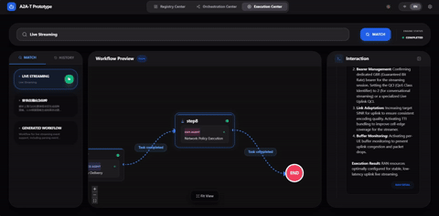

# 1 Project Introduction

## Background
From 2G to 5G, mobile communication networks have undergone four generations of evolution, with network scale and complexity growing exponentially. Traditional operations relying heavily on manual labor face challenges of high operational costs, pressure on user experience, and lack of business innovation. Since 2019, leading global operators have been promoting the Autonomous Network (AN) concept — transitioning networks from "manual operation" to "automated execution," ultimately achieving "autonomous governance," and classifying network autonomy levels as L1-L5.
AN L4's core characteristic is achieving end-to-end closed-loop autonomy in specific scenarios. To achieve L4, the problem of multi-vendor, cross-layer, cross-domain intelligent agent interconnection and collaboration must be solved. Although the industry currently has general agent protocols (such as A2A protocol) and orchestration tools (such as LangGraph) to address agent interconnection and collaboration, their application in the telecommunications domain faces issues such as network operations security risks, complex coding for operations engineers, and difficulty in reusing operations knowledge and tools. Therefore, OpenAN emerged.

## Core Vision

OpenAN is an autonomous network open-source project collection that supports the development and deployment of telecommunications intelligent agents through a series of open-source projects, enabling multi-vendor, cross-layer, cross-domain integration, and accelerating autonomous networks toward L4-L5.

- End-to-end closed-loop autonomous network: Accelerate cross-layer, cross-domain integration and deployment of telecommunications-specific agents, efficient multi-agent orchestration and collaboration, enabling global operators to accelerate the realization of AN L4.

- Vendor-neutral and open ecosystem: Based on industry standards (value scenario Solution Packages, agent interconnection protocols, etc.), advance vendor-neutral, industry-shared scenario-based "skills, components, knowledge, and practices," forming a telecommunications industry-wide cooperative ecosystem around AN, jointly improving the industry's AN level.

- Industry-led and future evolution: Drive OpenAN to become the de facto standard for the telecommunications industry, and explore integration and collaboration toward next-generation intelligent systems for AN L5.

## Project Architecture

OpenAN contains 6 modules, forming a complete intelligent agent collaboration framework:

1. A2A-T (Agent2Agent-Telecom) SDK: Provides intent templates for Agent interactions, validates message legality, provides message compression mechanisms, and improves interaction efficiency.

2. Registration and Orchestration: Provides AgentCard registration management capabilities, matches Skills by intent, and provides multi-functional agent process orchestration capabilities.

3. Scenario-based Practices: Operators/vendors share scenario-based practices (Solution packages), other operators can obtain references, modify and run them.

4. Runtime Engine: Responsible for parsing upper-level Agent intents, executing according to workflow, or auto-generating planning steps, and calling the telecommunications skill library as needed.

5. TSE(Telecommunications Strategy Evolution): Responsible for evaluating steps generated by the model, guiding the model prompt framework for continuous improvement.

6. Telecommunications Skills and Component Library: Responsible for skills, components, knowledge, etc. under various scenarios, contributed and shared by operators and vendors.

> **Note**: OpenAN's first open-source release includes A2A-T SDK, Registration and Orchestration, and Scenario-based Practices modules. Other modules will continue to evolve in subsequent versions.


# 2 Software Installation Guide

The overall software installation process is as follows:


![[photo]](figures/installflow.png)

## 2.1 System Requirements

This project is developed based on Python 3.10. Before compiling and installing, please ensure the target system meets the following requirements:

### Operating System

| Operating System | Minimum Version |
|---------|---------|
| Other Linux Distributions | Kernel 3.10+ |
| CentOS / RHEL | 7.0+ |
| Ubuntu | 18.04+ |
| Debian | 10+ |
> **Note**: Python 3.10 compilation requires a compiler supporting the C11 standard. GCC 5.0+ provides better optimization support. Glibc 2.17 is the minimum requirement for Python 3.10, and 2.28+ is recommended for better compatibility.


###  Verify System Environment

```bash
# Check GCC version
gcc --version

# Check Make version
make --version

# Check Glibc version
ldd --version
```

| Tool | Minimum Version | Recommended Version | View Command |
|-----|---------|---------|---------|
| GCC | 4.8.5 | 5.0+ | `gcc --version` |
| Make | 3.81 | 4.0+ | `make --version` |
| Glibc | 2.17 | 2.28+ | `ldd --version` |
> **Note**: Python 3.10 compilation requires a compiler supporting the C11 standard. GCC 5.0+ provides better optimization support. Glibc 2.17 is the minimum requirement for Python 3.10, and 2.28+ is recommended for better compatibility.

### Recommended Hardware Deployment Resources
| Node Type | Master Node Count | Worker Node Count | vCPU (cores) | Memory (GB) | Disk |
|--------|-------|-------|---------|--------|-----------|
| registry-center Node | 1 | 1 | 2 | 4 | System disk >= 100G |
| orchestration-center Node | 1 | 1 | 2 | 4 | System disk >= 100G |
| Database Node | 1 | 1 | 2 | 4 | System disk >= 100G |


### Minimum Deployment Resources
| Node Type | Master Node Count | Worker Node Count | vCPU (cores) | Memory (GB) | Disk |
|--------|-------|-------|---------|--------|----------|
| registry-center Node | 1 | 0 | 1 | 2 | System disk >= 50G |
| orchestration-center Node | 1 | 0 | 1 | 2 | System disk >= 50G |
| Database Node | 1 | 0 | 1 | 2 | System disk >= 50G |


### Node Requirements

Nodes can connect to external networks.<br>
Nodes can be accessed using the root user.<br>
The bootstrap node needs the tar tool installed.
> **Notice**: It is recommended that your node environment is clean, without any Kubernetes components installed, otherwise version conflicts may occur causing installation failure.


---

## 2.2 Dependency Installation

This project is developed based on Python 3.10. Before compiling and installing, please ensure the relevant component dependencies meet the following requirements:

| Component | Version | Description | Official Download Link |
| ---------- | ---------- |----------| ---------------------------------------------------------------- |
| Python | >= 3.10.15 | Project development language | https://www.python.org/ftp/python/3.10.15/Python-3.10.15.tgz     |
| PostgreSQL | >= 16.13 | Database storage service | https://ftp.postgresql.org/pub/source/v16.13/postgresql-16.13.tar.gz |
| NodeJS | >= 22.19.0 | orchestration-center frontend dependency | https://nodejs.org/dist/v22.19.0/node-v22.19.0-linux-x64.tar.xz   |

> The offline installation guides for each component are as follows. If the system already has the component and the version meets the requirements, you can skip these installation steps. PostgreSQL is used as the database example here; users can choose other databases based on actual scenarios.

### 2.2.1 Python Offline Installation Steps

First check whether Python is already installed on the environment and whether the version is 3.10.15. If so, skip the following installation steps.
```bash
python3 --version   # Check Python version
```


1.Download the installation package.

Execute the following command on a Linux server with network access to obtain the installation package. For Windows systems, visit the webpage directly to download.

```bash
wget https://www.python.org/ftp/python/3.10.15/Python-3.10.15.tgz
```

Transfer `Python-3.10.15.tgz` to the target server.

2.Extract the installation package.

```bash
tar -xzf Python-3.10.15.tgz
cd Python-3.10.15
```

3.Configure the installation path.

```bash
# Install to /usr/local/python310, avoid overwriting system Python
./configure --prefix=/usr/local/python310 --enable-optimizations
```

4.Compile and install.

```bash
make -j 4
sudo make altinstall
```

5.Create symbolic links.

```bash
# Create python3 symbolic link
sudo ln -sf /usr/local/python310/bin/python3 /usr/local/bin/python3

# Create pip3 symbolic link
sudo ln -sf /usr/local/python310/bin/pip3 /usr/local/bin/pip3
```

6.Verify installation.

```bash
python3 --version   # Should output Python 3.10.15
pip3 --version
```

**Notes**

- The installation path `/usr/local/python310` does not affect the system's built-in Python.
- Symbolic links are placed in `/usr/local/bin`, with lower priority than `/usr/bin`.
- The system's built-in `python` or `python2` commands remain unchanged.

### 2.2.2 Database Offline Installation Steps
By default, PostgreSQL database is used. Users can choose other databases based on actual scenarios. The following guide uses PostgreSQL as an example:

First check whether PostgreSQL is already installed on the environment and whether the version is 15.6. If so, skip the following installation steps.
```bash
psql --version
```

1.Download the installation package.

Execute the following command on a Linux server with network access to obtain the installation package. For Windows systems, visit the webpage directly to download.

```bash
wget https://ftp.postgresql.org/pub/source/v15.6/postgresql-15.6.tar.gz
```

Transfer `postgresql-15.6.tar.gz` to the target server.

2.Extract the installation package.

```bash
tar -xzf postgresql-15.6.tar.gz
cd postgresql-15.6
```

3.Configure the installation path.

```bash
# Install to /usr/local/pgsql
./configure --prefix=/usr/local/pgsql --without-readline
```

Common configuration options:
- `--prefix=/usr/local/pgsql`: Specify the installation path.
- `--with-openssl`: Enable SSL support.
- `--with-readline`: Enable readline support (enabled by default).
- `--with-zlib`: Enable zlib support (enabled by default).

4.Compile and install.

```bash
make -j 4
sudo make install
```

5.Create postgres user.

```bash
sudo useradd postgres
```

6.Create data directory and set permissions.

```bash
sudo mkdir -p /usr/local/pgsql/data
sudo chown -R postgres:postgres /usr/local/pgsql/data
```

7.Initialize the database.

```bash
su - postgres # Switch to postgres user
/usr/local/pgsql/bin/initdb -D /usr/local/pgsql/data
```

8.Start PostgreSQL service.

```bash
# Switch to postgres user
su - postgres

# Start in foreground
/usr/local/pgsql/bin/initdb -D /usr/local/pgsql/data
/usr/local/pgsql/bin/pg_ctl -D /usr/local/pgsql/data -l /usr/local/pgsql/data/logfile start

# Add system environment variable
echo "export PATH=/usr/local/pgsql/bin:\$PATH" >> ~/.bashrc
source ~/.bashrc

# Confirm successful startup
psql -l

# Check version
/usr/local/pgsql/bin/psql --version

# Connect to database
/usr/local/pgsql/bin/psql -c "SELECT version();"
```

To exit the `postgres` user, type `exit`.

9.Configure systemd service (optional).

```bash
sudo tee /etc/systemd/system/postgresql.service << EOF
[Unit]
Description=PostgreSQL 16 Database Server
After=network.target

[Service]
Type=forking
User=postgres
Group=postgres
Environment=PGDATA=/usr/local/pgsql/data
ExecStart=/usr/local/pgsql/bin/pg_ctl start -D /usr/local/pgsql/data -l /usr/local/pgsql/data/logfile
ExecStop=/usr/local/pgsql/bin/pg_ctl stop -D /usr/local/pgsql/data
ExecReload=/usr/local/pgsql/bin/pg_ctl reload -D /usr/local/pgsql/data
PIDFile=/usr/local/pgsql/data/postmaster.pid
TimeoutSec=300

[Install]
WantedBy=multi-user.target
EOF

sudo systemctl daemon-reload
sudo systemctl enable postgresql
sudo systemctl start postgresql
```

10.Create database and user.

```bash
# Switch to postgres user
su - postgres

# Enter SQL interactive interface
psql
```

Execute in psql:

```sql
CREATE USER registry_user WITH ENCRYPTED PASSWORD 'your_password' CREATEDB;
```

11.Configure remote access (using root user).

- Edit `/usr/local/pgsql/data/pg_hba.conf`, add at the end:

```bash
# Add allowed remote connections
host    all             all             0.0.0.0/0               scram-sha-256
```

- Edit `/usr/local/pgsql/data/postgresql.conf`:

```bash
# Modify listen address
listen_addresses = '*'
```

- Restart the service:

```bash
# Restart using systemctl (recommended)
sudo systemctl restart postgresql

# Or restart database configuration
su - postgres -c "/usr/local/pgsql/bin/pg_ctl -D /usr/local/pgsql/data restart"
```

**Notes**

- PostgreSQL uses port 5432 by default.
- Be sure to change the default password in production environments.
- Configure firewall rules to restrict database access.
- It is recommended to back up the database regularly.

### 2.2.3 NodeJS Offline Installation Steps
First check whether NodeJS is already installed on the environment and whether the version is 22.19.0. If so, skip the following installation steps.
```bash
node --version   # Should output v22.19.0
```
1.Download the installation package.

Execute the following command on a Linux server with network access to obtain the installation package. For Windows systems, visit the webpage directly to download

```bash
wget https://nodejs.org/dist/v22.19.0/node-v22.19.0-linux-x64.tar.xz
```

Transfer `node-v22.19.0-linux-x64.tar.xz` to the target server.

2.Extract the installation package.

```bash
tar -xJf node-v22.19.0-linux-x64.tar.xz -C /usr/local/
mv /usr/local/node-v22.19.0-linux-x64 /usr/local/nodejs
```

3.Configure environment variables.

```bash
# Add NodeJS to system environment variables
echo "export PATH=/usr/local/nodejs/bin:\$PATH" >> ~/.bashrc
source ~/.bashrc
```

4.Verify installation.

```bash
node --version   # Should output v22.19.0
npm --version
```

**Notes**

- NodeJS uses pre-compiled binary packages, no compilation toolchain required.
- The default installation path is `/usr/local/nodejs`.
- For production environments, it is recommended to use nvm to manage multiple NodeJS versions.

---

## 2.3 registry-center Offline Installation Steps
![[photo]](figures/install-registry-center-flow.png)
1.Prepare the installation package.

Download the registry-center source code: [registry-center-main-a2a1.0-20260430-release.zip](https://pan.quark.cn/s/4506a90cd7fc)

Download the offline service dependency package: [wheels.zip](https://pan.quark.cn/s/957150b18c0a)

Create a `/registry-center` folder in the temporary directory on the target server, and transfer the registry-center source code and offline service dependency package to this directory:

```bash
mkdir /tmp/registry-center
cd /tmp/registry-center
unzip registry-center-main-a2a1.0-20260430-release.zip
unzip wheels.zip -d ./registry-center-main-a2a1.0-20260430-release
```

2.Create virtual environment.

```bash
cd registry-center-main-a2a1.0-20260430-release

# Create virtual environment using installed Python 3.10
python3 -m venv venv --copies
```

3.Activate virtual environment.

```bash
# Activate virtual environment
source venv/bin/activate
```

After activation, the command line prefix will display `(venv)`.

4.Install dependencies offline.

```bash
# Install all dependencies offline from the wheels folder
pip install --no-index --find-links=wheels/ -r ./requirements.txt
```

5.Service installation configuration (optional).

You can configure the service deployment directory and other settings in the `./etc/systemd/deploy.conf` file. In offline installation mode, you do not need to modify this configuration file

```bash
vi ./etc/systemd/deploy.conf

# Registry Center Deployment Configuration
# Copyright (c) 2026 Huawei Technologies Co., Ltd.

# Deployment directory (service installation location)
INSTALL_DIR=/OpenA2A-T/registry-center

# Python path (leave empty to use  INSTALL_DIR/venv/bin/python3)
PYTHON_PATH=

# Service name
SERVICE_NAME=registry-center

# Whether to auto-install dependencies; in offline mode, prepare dependency packages yourself and set to false; when true, pip command will be used to download and install dependencies
INSTALL_DEPS=false
```

> To exit vi: press the Esc key, type :wq!


6.Modify database connection configuration.

Modify the registry-center configuration file: `./etc/conf/persistence.conf`

- Change `postgresql.host` to the IP of the database node

- Change `postgresql.port` to the PostgreSQL database port number, default is `5432`

- Modify username `postgresql.username` and password `postgresql.password` according to the actual database settings

7.Add executable permissions to scripts.

```bash
# Add executable permissions to scripts
chmod +x ./bin/*.sh
```

8.Install service to the specified directory.

```bash
# Install service to the INSTALL_DIR directory specified in step 3.5
sudo ./bin/install_service.sh install

# After successful execution, the following success message will be displayed:
# Installing the project to /OpenA2A-T/registry-center...
# Files copied successfully
# Deploy Configuration:
#   Install Dir: /OpenA2A-T/registry-center
#   Python Path: /OpenA2A-T/registry-center/venv/bin/python3
#   Install Deps: false
# 
# Using Python: /OpenA2A-T/registry-center/venv/bin/python3
# Python 3.10.15
# Service installed successfully!
```

9.Initialize service configuration.

```bash
# Enter the service installation directory
cd /OpenA2A-T/registry-center

# Initialize service configuration
./venv/bin/python3 -m agent_registry.init
```

The service supports HTTPS and AgentCard signing and signature verification capabilities by default. **For first-time startup, you can choose to disable these, and configure them later as needed by following this section.**

```bash
Whether to enable HTTPS enable_https (y/n, default: true): n
Whether to provide registry-center signing configuration registry.sign.enabled (y/n, default: true): n
Whether to enable signature verification capability signature_validation_enabled (y/n, default: true): n

==================================================
Persistent Storage Configuration
==================================================

Please select storage mode persistence.mode (file/postgresql, default: postgresql): file

Configuration completed, saved in /OpenA2A-T/registry-center/etc/conf/server.conf
```

10.Start service and status management.

```bash
# Start service
systemctl start registry-center

# View service status
systemctl status registry-center

# Stop service
systemctl stop registry-center
```

11.View service status logs.

```bash
# View all logs
journalctl -u registry-center

# Track logs in real time
journalctl -u registry-center
```

12.Uninstall service.

```bash
# Uninstall service from installation directory
sudo ./bin/install_service.sh uninstall
```

---

## 2.4 orchestration-center Offline Installation Steps
![[photo]](figures/install-orchestration-center-flow.png)

1.Prepare the installation package.

Download the orchestration-center source code: [orchestration-center-main-a2a1.0-20260430-release.zip](https://pan.quark.cn/s/346356c6a6aa)

Download the offline service dependency package: [wheels.zip](https://pan.quark.cn/s/7488f63ec3f6)

Create a `/orchestration-center` folder in the temporary directory on the target server, and transfer the orchestration-center source code and offline service dependency package to this directory:

```bash
mkdir /tmp/orchestration-center
cd /tmp/orchestration-center
unzip orchestration-center-main-a2a1.0-20260430-release.zip
unzip wheels.zip -d ./orchestration-center-main-a2a1.0-20260430-release
```

2.Create virtual environment.

```bash
cd orchestration-center-main-a2a1.0-20260430-release

# Create virtual environment using installed Python 3.10
python3 -m venv venv --copies
```

3.Activate virtual environment.

```bash
# Activate virtual environment
source venv/bin/activate
```

After activation, the command line prefix will display `(venv)`.

4.Install dependencies offline.

```bash
# Install all dependencies offline from the wheels folder
pip install --no-index --find-links=wheels/ -r ./requirements.txt
```

5.Service installation configuration (optional).

You can configure the service deployment directory and other settings in the `./etc/systemd/deploy.conf` file. In offline installation mode, you do not need to modify this configuration file

```bash
vi ./etc/systemd/deploy.conf

# Orchestration Center Deployment Configuration
# Copyright (c) 2026 Huawei Technologies Co., Ltd.

# Deployment directory (service installation location)
INSTALL_DIR=/OpenA2A-T/orchestration-center

# Python path (leave empty to use  INSTALL_DIR/venv/bin/python3)
PYTHON_PATH=

# Service name
SERVICE_NAME=orchestration-center

# Whether to auto-install dependencies; in offline mode, prepare dependency packages yourself and set to false; when true, pip command will be used to download and install dependencies
INSTALL_DEPS=false
```

> To exit vi: press the Esc key, type :wq!

6.Modify database connection configuration.

Modify the orchestration-center configuration file: `./etc/conf/db_config.conf`

- Change `host` to the IP of the PostgreSQL database node

- Change `port` to the PostgreSQL database port number, default is `5432`

- Modify username `user` and password `password` according to the actual database settings

7.Add executable permissions to scripts.

```bash
# Add executable permissions to scripts
chmod +x ./bin/*.sh
```

8.Install service to the specified directory.

```bash
# Install service to the INSTALL_DIR directory specified in step 4.5
sudo ./bin/install_service.sh install

# After successful execution, the following success message will be displayed:
# Installing the project to /OpenA2A-T/orchestration-center...
# Files copied successfully
# Deploy Configuration:
#   Install Dir: /OpenA2A-T/orchestration-center
#   Python Path: /OpenA2A-T/orchestration-center/venv/bin/python3
#   Install Deps: false
# 
# Using Python: /OpenA2A-T/orchestration-center/venv/bin/python3
# Python 3.10.15
# Service installed successfully!
```

9.Initialize service configuration (requires database configuration).

```bash
# Enter the service installation directory
cd /OpenA2A-T/orchestration-center

# Initialize service configuration, can configure service port, whether to enable HTTPS, etc.
vi ./etc/conf/server.conf
```

The service supports HTTPS capability by default. **For first-time startup, you can choose to disable it, and configure it later as needed by following this section**

```bash
# Set enable_https=false
:wq!
```

10.Start service and status management.

```bash
# Start service
systemctl start orchestration-center

# View service status
systemctl status orchestration-center

# Stop service
systemctl stop orchestration-center
```

11.View service status logs.

```bash
# View all logs
journalctl -u orchestration-center

# Track logs in real time
journalctl -u orchestration-center
```

12.Uninstall service.

```bash
# Uninstall service from installation directory
sudo ./bin/install_service.sh uninstall
```

---

## 2.5 orchestration-center Frontend Offline Installation Steps

The frontend code has been integrated into the orchestration-center code repository. After completing [Section 2.4](#24-orchestration-center-offline-installation-steps), the frontend code is already installed. You only need to start the frontend service. The startup steps are as follows:

Enter the `workflow-designer` directory under the orchestration-center installation directory:

```bash
cd {installation directory}/orchestration-center/workflow-designer
npm install --force
npm run dev
```

After successful startup, you can access the orchestration-center frontend interface via browser at `http://localhost:3003`.

---

## 2.6 A2A-T SDK Offline Installation Steps

A2A-T SDK includes A2A-T Python SDK and A2A-T Java SDK, which are the Python/Java implementations of the A2A-T protocol. A2A-T Python SDK provides task prompt generation, prompt validation, and multi-round negotiation capabilities for client Agents and server Agents. A2A-T Java SDK provides client prompt generation, server prompt validation, negotiation runtime, and A2A Java integration examples for Java Agents.

- A2A-T Python SDK

[Installation and configuration instructions are in the Python SDK User Guide](https://gitcode.com/OpenAN/a2a-t-sdk/blob/main/docs/zh/%E7%94%A8%E6%88%B7%E6%8C%87%E5%8D%97.md)

The Python SDK source code is in the `a2a-t-sdk` repository, and the end-to-end demonstration samples are in the `a2a-t-samples` repository. The SDK itself requires Python 3.12+, and the current samples repository uses Python 3.14 per its README requirements.

- A2A-T Java SDK

[Installation and configuration instructions are in the Java SDK User Guide](https://gitcode.com/OpenAN/a2a-t-java/blob/main/docs/zh/%E7%94%A8%E6%88%B7%E6%8C%87%E5%8D%97.md)

The Java SDK source code and examples are both in the `a2a-t-java` repository. Before running, you need to prepare JDK 17+, Maven, and configure an available LLM service address and API Key.

---

# 3 Quick Start

## 3.1 registry-center and orchestration-center


The registry-center is a service focused on unified Agent management, supporting centralized registration and management of Agents from different vendors, achieving controllable access and maintenance of multi-source Agents. Key features include:

- **Register AgentCard**: Supports registering Agents from different vendors to the center for unified management.
- **Query AgentCard List**: Query the list of AgentCards that meet specified conditions.
- **Query Specified AgentCard**: Find a unique AgentCard instance by AgentCard name and organization.
- **Update Specified AgentCard**: Update information of a specified AgentCard.
- **Delete Specified AgentCard**: Delete AgentCards that are no longer in use.
- **Semantic Search for AgentCard**: Search for matching AgentCards based on natural language semantics.

Through these features, the registry-center helps users efficiently integrate, maintain, and discover various Agents, providing foundational capabilities for upper-level orchestration and collaboration.

The orchestration-center is a visual orchestration platform for multi-agent collaboration, supporting the definition of invocation relationships and execution flows between Agents through a graphical workflow designer. The backend is based on a Python framework that parses flows and drives Agent collaboration, helping users efficiently build, manage, and run complex Agent collaboration workflows. Key features include:

- **PSOP (Parallel Standard Operating Procedure) Management**: Supports listing, detail querying, saving, and deleting workflows (PSOPs).
- **PDF Parsing**: Provides PDF file content parsing capabilities, providing data support for subsequent flow design.
- **Intelligent Planning**: Automatically generates workflow planning based on user requirements, lowering the orchestration threshold.
- **Agent Management**: Retrieves the full AgentCard list, facilitating understanding of available capabilities and invocation methods.
- **Natural Language PSOP Generation**: Generates executable orchestration flows directly from natural language intents.
- **Intent-based PSOP Retrieval**: Retrieves matching historical workflows based on natural language descriptions.
- **Real-time Flow Execution**: Supports starting PSOP execution in streaming mode, with real-time progress push for monitoring and debugging.

### 3.1.1 Start Services
#### 3.1.1.1 Start registry-center Service
[For startup instructions, see the registry-center User Guide](https://gitcode.com/OpenAN/registry-center/blob/main/docs/zh/%E6%B3%A8%E5%86%8C%E4%B8%AD%E5%BF%83%E7%94%A8%E6%88%B7%E6%8C%87%E5%8D%97.md#%E5%90%AF%E5%8A%A8CLI)

#### 3.1.1.2 Start orchestration-center Backend Service
[For startup instructions, see the orchestration-center User Guide](https://gitcode.com/OpenAN/orchestration-center/blob/main/docs/zh/%E7%94%A8%E6%88%B7%E6%8C%87%E5%8D%97.md#222-%E5%90%AF%E5%8A%A8%E7%BC%96%E6%8E%92%E4%B8%AD%E5%BF%83%E5%90%8E%E7%AB%AF%E6%9C%8D%E5%8A%A1)

#### 3.1.1.3 Start orchestration-center Frontend Interface
[For startup instructions, see the orchestration-center User Guide](https://gitcode.com/OpenAN/orchestration-center/blob/main/docs/zh/%E7%94%A8%E6%88%B7%E6%8C%87%E5%8D%97.md#223-%E5%AE%89%E8%A3%85%E5%89%8D%E7%AB%AF%E4%BE%9D%E8%B5%96%E5%B9%B6%E5%90%AF%E5%8A%A8)

### 3.1.2 Example Agent Introduction
  	 
This section uses the live event broadcasting assurance scenario as an example to introduce how multiple Agents collaborate to achieve end-to-end closed-loop autonomy.
  	 
**Scenario Background**

In the live event broadcasting scenario, network stability during the broadcast must be ensured to guarantee a smooth viewing experience for audiences. This scenario involves the collaboration of three intelligent agents: Live Streaming Agent, Assurance Agent, and RAN Agent.
  	 
**Agent Role Description**
  	 
| Agent Name | Responsibility |
| --- | --- |
| Live Streaming Agent | Responsible for parsing and monitoring event requirements |
| Assurance Agent | Responsible for generating assurance strategies and recovery strategies |
| RAN Agent | Responsible for radio network analysis, planning, and strategy execution |
  	 
**Collaboration Flow**
   
  The entire live event broadcasting assurance flow consists of two phases: assurance execution and assurance recovery:

- Phase 1: Assurance Execution Flow
```mermaid
  	 flowchart LR
  	     A[Live Streaming Agent<br/>Extract event route and business requirements] --> B[Live Streaming Agent<br/>Send requirements to Assurance Agent]
  	     B --> C[Assurance Agent<br/>Convert event assurance requirements to network requirements]
  	     C --> D[Assurance Agent<br/>Send network requirements to RAN Agent]
  	     D --> E[RAN Agent<br/>Analyze network current status]
  	     E --> F[RAN Agent<br/>Plan network strategy solution]
  	     F --> G[RAN Agent<br/>Execute network strategy solution]
  	     G --> H[Live Streaming Agent<br/>Real-time feedback of KQI metrics and task status]
 ```
- Phase 2: Assurance Recovery Flow
```mermaid
  	 flowchart LR
  	     H[Live Streaming Agent<br/>Real-time feedback of KQI metrics and task status] --> I[Assurance Agent<br/>Send network configuration recovery instructions]
  	     I --> J[RAN Agent<br/>Execute network configuration recovery]
 ```
  	 
The following video demonstrates the complete multi-Agent collaboration flow in the live event broadcasting assurance scenario, covering both the assurance execution and assurance recovery phases:



### 3.1.3 Start Example Agents
To quickly experience the complete flow, you can start the example Agent services included in the project.
```bash
cd {project path}/orchestration-center/samples
python start_agents_server.py
```
This script will:
- Register multiple example Agents with the registry-center.
- Start the corresponding Agent services for the orchestration-center to invoke.
### 3.1.4 Core Flow Verification
After completing the above steps, you can experience OpenAN's core capabilities by following this flow:


1.Access the orchestration-center interface.

Open a browser and access `http://localhost:3003`

2.  Configure service address.

Click the gear icon in the upper right corner of the interface, modify the backend IP and port to the actual address of the orchestration-center backend, and save.

3.View Agent library.

The left side displays all Agents retrieved from the registry-center, which can be searched by name or function.

4.Create a workflow.
   
Click the `+` button and select the creation method: ([For detailed creation flow, see the orchestration-center User Guide](https://gitcode.com/OpenAN/orchestration-center/blob/main/docs/zh/%E7%94%A8%E6%88%B7%E6%8C%87%E5%8D%97.md))

| Method | Operation Description |
| --- | --- |
| PDF Import | Upload a PDF file, the system automatically parses and generates a PSOP |
| Manual Orchestration | Drag Agent cards to the canvas, define execution order through connections |
| Natural Language Generation | Enter business intent description, the backend automatically orchestrates and generates a PSOP |

5.Execute workflow
- Enter user intent, click the "Search Workflow" button
- Select the matching PSOP
- Click the `▶` button to execute, the right area displays the execution process in real time

## 3.2 A2A-T SDK

### 3.2.1 A2A-T Python SDK

A2A-T Python SDK is the Python implementation of the A2A-T protocol, providing task prompt generation, prompt validation, and multi-round negotiation capabilities for client Agents and server Agents. Key features include:

- **Task Prompt Generation**: The client generates A2A-T processed task prompt based on user natural language or structured input.
- **Task Prompt Validation**: The server validates the scenario, template, slot, and semantic consistency of the processed task prompt.
- **Multi-round Negotiation**: Supports four types of negotiation flows: information, clarification, feasibility, and fulfillment.
- **Prompt Resource Management**: Supports loading local scenario, slot, template, and system prompt resources.
- **LLM Adaptation**: Connects to external large models via OpenAI-compatible approach.

Through these capabilities, the Python SDK can help developers quickly build Python Agents that comply with A2A-T interaction specifications, and integrate with A2A protocol links, registry-center, and orchestration-center.

#### 3.2.1.1 Start Example Agent

To quickly experience the Python SDK, you can run the examples in `a2a-t-samples`.

1.Install sample dependencies.

```bash
cd {project path}/a2a-t-samples
uv python pin 3.14
uv sync
```

2.Run the Hello World example.
```bash
cd {project path}/a2a-t-samples/samples/helloworld
cp env.example .env
# Edit .env, fill in A2AT_LLM_API_KEY

../../.venv/Scripts/python.exe server_main.py
```

Open another terminal to start the client:

```bash
cd {project path}/a2a-t-samples/samples/helloworld
../../.venv/Scripts/python.exe client_main.py
```

3.Run the Subscribe Incident example.

```bash
cd {project path}/a2a-t-samples/samples/subscribe_incident
cp env.example .env
# Edit .env, fill in A2AT_LLM_API_KEY

../../.venv/Scripts/python.exe server_main.py
```

Open another terminal to start the client:

```bash
cd {project path}/a2a-t-samples/samples/subscribe_incident
../../.venv/Scripts/python.exe client_main.py
```

#### 3.2.1.2 Core Flow Verification

After completing the above steps, you can experience the Python SDK's core capabilities by following this flow:

1.The client generates a processed task prompt based on the SDK's built-in prompt resources.
2.The client sends the prompt to the server via an A2A request.
3.The server calls the SDK to validate the prompt.
4.If task information is insufficient, the server initiates negotiation.
5.The client supplements information and continues negotiation.
6.After the server validates successfully, it executes business logic and returns the result.

The Hello World example is used to verify the minimum link, and the Subscribe Incident example is used to verify multi-round negotiation in the incident subscription scenario. For detailed instructions, see:

- [Python SDK User Guide](https://gitcode.com/OpenAN/a2a-t-sdk/blob/main/docs/zh/%E7%94%A8%E6%88%B7%E6%8C%87%E5%8D%97.md)
- [Python SDK Developer Guide](https://gitcode.com/OpenAN/a2a-t-sdk/blob/main/docs/zh/%E5%BC%80%E5%8F%91%E6%8C%87%E5%8D%97.md)

### 3.2.2 A2A-T Java SDK

A2A-T Java SDK is the Java implementation of the A2A-T protocol, providing client prompt generation, server prompt validation, negotiation runtime, and A2A Java integration examples for Java Agents. Key features include:

- **Client Prompt Generation**: Generate A2A-T processed task prompt via `A2ATClient`.
- **Server Prompt Validation**: Validate the scenario, slot, and semantic consistency of the prompt via `A2ATServer`.
- **Negotiation Flow**: Supports multi-round information supplementation, clarification, feasibility confirmation, and fulfillment confirmation.
- **Maven Multi-module Project**: Organized by core, resources, llm, prompt, negotiation, client, server, and sample layers.
- **A2A HTTP Example**: `a2a-t-sample` demonstrates end-to-end invocation based on A2A Java HTTP+JSON/REST links.

Through these capabilities, the Java SDK can help developers reuse A2A-T's task expression, validation, and negotiation capabilities in Java Agents, and discover target Agents through the registry-center.

#### 3.2.2.1 Start Example Agent

The Java example module is `a2a-t-java/a2a-t-sample`. Before running the example, please start the registry-center service first and confirm that the registry-center address in `client.env` and `server.env` is configured correctly.

1.Compile the example.

```bash
cd {project path}/a2a-t-java
mvn "-Dmaven.repo.local=.mvn/repository" -pl a2a-t-sample -am -DskipTests package
```

2.Start the server.

```bash
java @a2a-t-sample/target/server.javaargs.txt
```

The server will start the A2A HTTP service and register an example AgentCard with the registry-center.

3.Start the client.

Open another terminal and execute:

```bash
cd {project path}/a2a-t-java
java @a2a-t-sample/target/client.javaargs.txt
```

The client will query the target AgentCard from the registry-center, generate an A2A-T prompt, and send an A2A HTTP+JSON/REST request to the server.

#### 3.2.2.2 Core Flow Verification

After completing the above steps, you can experience the Java SDK's core capabilities by following this flow:

1.The server starts and registers the AgentCard.
2.The client queries the target AgentCard from the registry-center.
3.The client calls `A2ATClient` to generate a processed task prompt.
4.The client constructs an A2A HTTP+JSON/REST request.
5.The server receives the request and calls `A2ATServer` to validate the prompt.
6.After the server validates successfully, it returns the task status, message, or artifact event.

For detailed instructions, see:

- [Java SDK User Guide](https://gitcode.com/OpenAN/a2a-t-java/blob/main/docs/zh/%E7%94%A8%E6%88%B7%E6%8C%87%E5%8D%97.md)
- [Java SDK Developer Guide](https://gitcode.com/OpenAN/a2a-t-java/blob/main/docs/zh/%E5%BC%80%E5%8F%91%E6%8C%87%E5%8D%97.md)