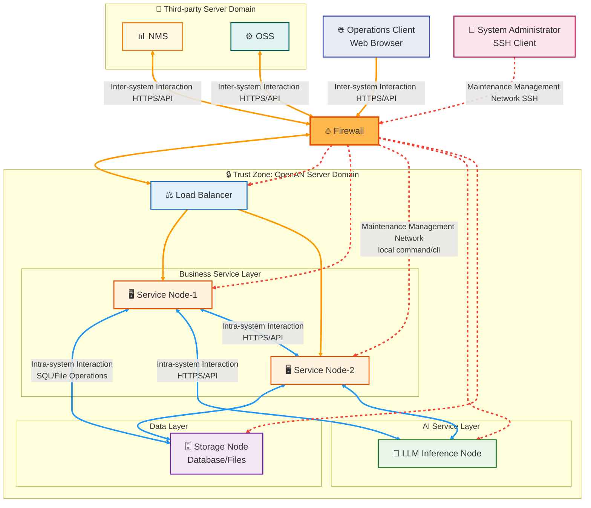

# OpenAN Security Technology Whitepaper

## Table of Contents

1. [Overview](#overview)
2. [Security Architecture Design](#security-architecture-design)
3. [Network Security](#network-security)
4. [Platform Security](#platform-security)
5. [Application Security](#application-security)
6. [Data Security](#data-security)
7. [Security Operations Best Practices](#security-operations-best-practices)
8. [Security Audit and Monitoring](#security-audit-and-monitoring)
9. [Security Incident Response](#security-incident-response)
10. [Security Compliance](#security-compliance)
11. [Design Constraints and Limitations](#design-constraints-and-limitations)
12. [Appendix](#appendix)

---

## Overview

### Project Introduction

OpenAN is an autonomous network open source project collection that supports the development and deployment of communication agents through a series of open source projects, enabling multi-vendor, cross-layer, and cross-domain integration, accelerating autonomous networks toward L4-L5. [See "OpenAN Quick Start" Project Introduction chapter](./quick_start.md#1-project-introduction).

This whitepaper is intended for open source community users, architects, and design roles, explaining OpenAN's security technology architecture, security mechanisms, and security best practices.

### Security Objectives

OpenAN's security design follows these core objectives:

| Security Objective | Description |
|---------|------|
| **Confidentiality** | Protect sensitive data from unauthorized access, including transmission encryption and storage encryption |
| **Integrity** | Ensure data is not tampered with during transmission and storage, providing signature verification mechanisms |
| **Availability** | Ensure stable service operation, with fault recovery and disaster tolerance capabilities |
| **Auditability** | Record key operation logs, supporting traceability and analysis of security incidents |
| **Least Privilege** | Components and services run with minimum necessary privileges, reducing security risks |

### Target Readers

- System architects: Understand OpenAN security architecture design for system integration planning
- Security engineers: Evaluate OpenAN security capabilities and develop security hardening plans
- Operations personnel: Reference security configuration and operations best practices
- Developers: Understand security mechanisms for security-compliant development

---

## Security Architecture Design

### Overall Security Architecture

OpenAN adopts a layered security architecture model, building a defense-in-depth system from three layers: network security, platform security, and application security:

```
┌────────────────────────────────────────────────────────────────────────────────────────────────┐
│                                Application Security Layer                                │
│  ┌──────────────────────────┐ ┌──────────────────────────┐ ┌──────────────────────────┐  │
│  │   Transport Encryption   │ │      Authentication      │ │        Log Audit         │  │
│  └──────────────────────────┘ └──────────────────────────┘ └──────────────────────────┘  │
│  ┌──────────────────────────┐ ┌──────────────────────────┐ ┌──────────────────────────┐  │
│  │      Data Protection     │ │   Interface Protection   │ │  Signature Verification  │  │
│  └──────────────────────────┘ └──────────────────────────┘ └──────────────────────────┘  │
├────────────────────────────────────────────────────────────────────────────────────────────────┤
│                                Platform Security Layer                                 │
│  ┌──────────────────────────┐ ┌──────────────────────────┐ ┌──────────────────────────┐  │
│  │     System Hardening     │ │     Security Patches     │ │        Anti-virus        │  │
│  └──────────────────────────┘ └──────────────────────────┘ └──────────────────────────┘  │
├────────────────────────────────────────────────────────────────────────────────────────────────┤
│                                Network Security Layer                                  │
│  ┌──────────────────────────┐ ┌──────────────────────────┐ ┌──────────────────────────┐  │
│  │ Security Domain Partition│ │    Firewall Isolation    │ │     Network Isolation    │  │
│  └──────────────────────────┘ └──────────────────────────┘ └──────────────────────────┘  │
└────────────────────────────────────────────────────────────────────────────────────────────────┘
```


### Security Threat Model

OpenAN has designed protections against the following major security threats:

| Threat Type | Threat Description | Protection Measure |
|---------|---------|---------|
| Unauthorized Access | External systems or users access OpenAN services without authorization | Authentication mechanism, firewall policies, network isolation |
| Data Leakage | Sensitive data stolen during transmission or storage | TLS encryption, sensitive data masking, access control |
| Data Tampering | AgentCard or configuration data maliciously modified | Signature verification mechanism, integrity check |
| Denial of Service | Attackers consume system resources through massive requests | Traffic control, request size limitation |
| Privilege Escalation | Service processes gain higher privileges to execute malicious operations | Non-root operation, least privilege principle |
| Man-in-the-Middle Attack | Communication data intercepted and tampered during transmission | TLS mutual authentication, certificate verification |


---

## Network Security

### Deployment Mode

OpenAN currently only supports **OP (On-Premise) deployment mode** and is not open to the public network. The system is deployed in the customer's intranet environment, with protection provided through security domain partitioning, firewall isolation, and internal/external communication network isolation.

### Security Domain Partitioning

Security domains are partitioned based on different risk levels:

| Security Domain | Risk Level | Deployment Content | Protection Requirement |
|---------|---------|---------|---------|
| **OpenAN Server Domain** | High (Trust Zone) | registry-center, orchestration-center, database, LLM inference node | Strict access control, only authorized access allowed |
| **Third-party Server Domain** | Medium | NMS, OSS, 3A servers and other external systems | Isolated from trust zone through firewall |
| **Operations Personnel Client Access Domain** | Medium-Low | Web browser access terminal | HTTPS encrypted access, identity authentication |
| **System Administrator Access Domain** | Medium-Low | SSH management terminal | SSH encrypted, privileged account management |

### Networking Recommendations

The following is an example of OpenAN networking recommendations. Complete secure networking should be defined by the customer based on their actual environment:



### Firewall Policies

Different security domains are isolated and protected through firewalls. Firewall configuration should follow these principles:

#### Basic Policies

| Policy Type | Description |
|---------|------|
| **Default Deny** | Default deny all cross-domain traffic, only explicitly allow legitimate traffic |
| **Minimum Opening** | Only open ports and protocols necessary for business |
| **Bidirectional Control** | Implement access control for both inbound and outbound traffic |
| **Log Recording** | Record all firewall events, supporting audit traceability |

#### Access Control List (ACL) Policy Types

| Policy Type | Control Granularity | Applicable Scenario |
|---------|---------|---------|
| **Basic Control Policy** | Allow or deny based on specified source IP address | Management network access control |
| **Extended Access Control Policy** | Five-tuple (source address, destination address, source port, destination port, protocol) | Fine-grained business service control |

#### Port Opening Recommendations

Inbound traffic:

| Service | Port | Protocol | Access Source |
|------|------|------|---------|
| registry-center service | As configured (default HTTPS) | HTTPS | Operations client, orchestration-center |
| orchestration-center backend | As configured (default HTTPS) | HTTPS | Operations client |
| orchestration-center frontend | 3003 | HTTP | Operations client (intranet) |
| PostgreSQL | 5432 | TCP | OpenAN service nodes |
| SSH management | 22 | SSH | System administrator domain |

Outbound traffic: 1024~65535


### Internal/External Communication Isolation

OpenAN service nodes receive requests from different sources, reducing security risks through network plane isolation:

| Network Plane | Exposure Location | Request Source | Security Risk | Protection Level |
|---------|---------|---------|---------|---------|
| **External Network Plane** | External IP | Third-party systems, operations clients | Higher | High-level protection (TLS, authentication) |
| **Internal Network Plane** | Internal IP | Internal inter-service interactions | Lower | Basic protection |
| **Management Network Plane** | localhost (UDS) | System administrator backend management | Lowest | Local privilege control |

**Protection Measures**:

- External network plane: Must enable TLS encryption, identity authentication, request validation
- Internal network plane: Recommended to enable TLS encryption, inter-service authentication
- Management network plane: Strictly control access privileges, prevent privilege escalation attacks


---

## Platform Security

Platform security enhances the operating system security level through system hardening, security patches, anti-virus, and other measures, providing a secure and reliable runtime platform for the application layer.

### System Hardening

#### Hardening Objectives

| Objective | Description |
|------|------|
| **Minimization Principle** | Only open ports, privileges, and services necessary for business |
| **Dedicated Principle** | Provide dedicated security hardening policies for different operating systems |
| **Applicability Principle** | Hardening policies are strictly tested and do not affect business operations |
| **Auditability Principle** | Security policy changes are traceable, supporting audit retrospection |

#### Hardening Policy Checklist

| Category | Hardening Item | Description |
|------|--------|------|
| **System Services** | Disable unnecessary services | Turn off system services not required for business |
| **File Permissions** | Minimum privilege settings | Configure minimum access permissions for files and directories |
| **Kernel Configuration** | Security parameter adjustment | Kernel parameter security configuration (e.g., disable core dump) |
| **Protocol Configuration** | Network protocol hardening | TCP/IP protocol stack security parameter configuration |
| **Access Control** | Privilege boundary settings | File system access control policies |
| **Account Security** | Password policy configuration | Strong password policies, account lockout policies |
| **Log Audit** | Audit policy enablement | System operation log recording |
| **Patch Check** | Regular updates | Regularly check and install security patches |

#### History Command Handling

The system must disable the history command by default:

```bash
# Example of disabling history command
unset HISTFILE
# Or configure history to ignore sensitive commands
export HISTIGNORE='*password*:*secret*:*key*'
```

---

## Application Security

Application security covers mechanisms such as transmission security, authentication and authorization, log audit, and interface protection, ensuring business-level security.

### Transmission Security

#### Transport Layer Security (TLS) Encrypted Communication

| Component | Encryption Requirement | Description |
|------|---------|------|
| Inter-service communication | TLS 1.2 / TLS 1.3 | Between registry-center and orchestration-center |
| Database access | SSL connection (TLS 1.2+) | PostgreSQL connection encryption |
| API interface | HTTPS (TLS 1.2 / TLS 1.3) | External service interfaces enforce HTTPS |
| LLM interface | HTTPS (TLS 1.2 / TLS 1.3) | Encrypted communication with LLM inference node |

#### TLS Protocol Version Requirements

| Protocol Version | Support Status | Description |
|---------|---------|------|
| **TLS 1.3** | Recommended | Latest standard, highest security, better performance |
| **TLS 1.2** | Supported | Widely compatible, good security |
| **TLS 1.1** | Disabled | Deprecated, has security risks |
| **TLS 1.0** | Disabled | Deprecated, has security risks |
| **SSL v3** | Disabled | Deprecated, has serious security vulnerabilities (POODLE) |
| **SSL v2** | Disabled | Deprecated, has serious security vulnerabilities |

#### TLS Cipher Suite Requirements

**TLS 1.3 Recommended Cipher Suites** (preferably used):

| Cipher Suite Name | Description |
|-------------|------|
| `TLS_AES_256_GCM_SHA384` | AES-256-GCM encryption, SHA-384 message authentication |
| `TLS_AES_128_GCM_SHA256` | AES-128-GCM encryption, SHA-256 message authentication |
| `TLS_CHACHA20_POLY1305_SHA256` | ChaCha20-Poly1305 encryption, suitable for mobile devices |

**TLS 1.2 Recommended Cipher Suites**:

| Cipher Suite Name | Description |
|-------------|------|
| `TLS_ECDHE_RSA_WITH_AES_256_GCM_SHA384` | ECDHE key exchange, RSA authentication, AES-256-GCM encryption |
| `TLS_ECDHE_RSA_WITH_AES_128_GCM_SHA256` | ECDHE key exchange, RSA authentication, AES-128-GCM encryption |
| `TLS_ECDHE_ECDSA_WITH_AES_256_GCM_SHA384` | ECDHE key exchange, ECDSA authentication, AES-256-GCM encryption |
| `TLS_ECDHE_ECDSA_WITH_AES_128_GCM_SHA256` | ECDHE key exchange, ECDSA authentication, AES-128-GCM encryption |
| `TLS_ECDHE_RSA_WITH_CHACHA20_POLY1305_SHA256` | ECDHE key exchange, ChaCha20-Poly1305 encryption |

**Disabled Cipher Suites**:

| Disabled Cipher Suite | Reason for Disabling |
|-------------|---------|
| Suites using `DES`, `3DES` | Insufficient encryption strength, vulnerable to SWEET32 attacks |
| Suites using `RC4` | Stream cipher proven insecure |
| Suites using `CBC` mode | Vulnerable to BEAST, Lucky13 and other attacks |
| Suites using `MD5` | Hash algorithm proven insecure |
| Suites using `SHA-1` | Hash algorithm proven to have collision risks |
| Suites using static `RSA` key exchange | Does not support Forward Secrecy |
| Suites using `DH` (< 2048 bits) | Insufficient key length, vulnerable to Logjam attacks |


### Authentication and Authorization

#### Authentication Mechanism

| Authentication Method | Applicable Scenario | Description |
|---------|---------|------|
| **Certificate Authentication** | TLS mutual authentication | Inter-service authentication for high-security scenarios |
| **Token Authentication** | API interface | Extensible interface authentication mechanism |
| **Database Authentication** | PostgreSQL | Username/password authentication, scram-sha-256 encryption |


#### Authorization Mechanism

| Authorization Dimension | Description |
|---------|------|
| **Interface Authorization** | API interface access privilege control, extensible interface authorization mechanism |
| **Data Authorization** | Data access scope limitation |
| **Operation Authorization** | Operation type privilege control |

### Interface Protection

#### HTTP Request Limitations

| Limitation Item | Default Value | Description |
|--------|--------|------|
| **Request Size** | 2MB | Prevent large requests from consuming resources |
| **Request Rate** | Configurable | Prevent request flooding attacks |
| **Connection Timeout** | Configurable | Prevent connection occupation |

#### Input Validation

| Validation Item | Description |
|--------|------|
| **Parameter Validation** | API parameter type, range, format validation |
| **Injection Protection** | SQL injection, command injection protection |
| **Format Validation** | JSON format validation, AgentCard format validation |


### Runtime Security

| Security Item | Requirement | Description |
|--------|------|------|
| **Runtime User** | Non-root | Services run as regular users |
| **File Permissions** | Minimum privilege | Minimize configuration file permissions |
| **Privilege Escalation Protection** | No escalation | Do not execute sudo or privilege escalation operations |
| **Process Isolation** | Independent processes | Service processes are isolated from each other |

---

## Data Security

### AgentCard Security

#### AgentCard Content Restrictions

AgentCard must not contain the following:

| Prohibited Content | Description |
|---------|------|
| **Sensitive Data** | Passwords, keys, tokens, etc. |
| **Confidential Data** | Commercial secrets, internal confidential information |
| **Personal Information** | User names, contact information, identity information |

#### AgentCard Integrity Protection

registry-center provides AgentCard signing and verification mechanisms:

| Function | Description |
|------|------|
| **Signing Mechanism** | Digitally sign AgentCard upon registration |
| **Verification Mechanism** | Verify signature upon query, validating data integrity |
| **Signing Algorithm** | Uses secure signing algorithm (e.g., RSA-SHA256) |


### Sensitive Data Protection

#### Storage Security

| Data Type | Protection Measure |
|---------|---------|
| **Database Password** | Encrypted storage, configuration file privilege control |
| **API Token** | Encrypted storage, periodic rotation |
| **Certificate Private Key** | Privilege control, secure storage |

#### Transmission Security

| Scenario | Protection Measure |
|------|---------|
| **Configuration Transmission** | TLS encrypted transmission |
| **Log Output** | Masking processing, no output of sensitive information |
| **Interactive Input** | Do not record sensitive input in logs or history |

#### Sensitive Data Handling Specification

```bash
# When entering sensitive information interactively
# 1. Use secure input methods (e.g., environment variables)
export DB_PASSWORD=$(cat secure_file)

# 2. Do not pass sensitive information directly in command arguments
# Bad example: mysql -u user -p password
# Good example: mysql -u user -p  # System prompts for password

# 3. Log masking configuration
# Ensure log configuration does not record complete passwords, keys, etc.
```

### Database Security

#### PostgreSQL Security Configuration

| Configuration Item | Security Requirement | Description |
|--------|---------|------|
| **Authentication Method** | scram-sha-256 | Strong password authentication mechanism |
| **Connection Encryption** | SSL enabled | Connection layer encryption |
| **Access Control** | pg_hba.conf | IP whitelist control |
| **Password Policy** | Strong password | Regular password changes |
| **Backup Encryption** | Encrypted backup | Backup files encrypted storage |

---

## Security Operations Best Practices

### Certificate Management

#### Self-signed Certificate Generation Tool

OpenAN provides a self-signed certificate generation tool for development and testing environments:

| Tool Usage | Applicable Scenario |
|---------|---------|
| **Generate CA Certificate** | Create local test CA |
| **Generate Service Certificate** | Generate TLS certificates for services |
| **Generate Client Certificate** | For mutual TLS authentication |

> **Notice**: It is recommended to use certificates issued by a formal CA authority in production environments.

#### Certificate Lifecycle Management

| Management Item | Requirement |
|--------|------|
| **Certificate Validity Period** | Monitor certificate expiration time, update in advance |
| **Private Key Protection** | Strictly protect private keys, prevent leakage |
| **Certificate Rotation** | Regularly rotate certificates, reduce risk |
| **Certificate Revocation** | Promptly revoke leaked or invalid certificates |

### Account Management

| Management Item | Best Practice |
|--------|---------|
| **Account Creation** | Create as needed, avoid over-authorization |
| **Password Policy** | Strong password: length ≥ 8, including uppercase, lowercase, numbers, special characters |
| **Regular Change** | Change passwords regularly (recommended every 90 days) |
| **Account Lockout** | Lock account after multiple failed attempts |
| **Departure Handling** | Promptly delete accounts of departing personnel |

### High-risk Agent Review

registry-center provides high-risk Agent review functionality:

| Review Dimension | Description |
|---------|------|
| **Source Review** | Verify the legitimacy of the Agent source |
| **Privilege Review** | Review the operation privileges requested by the Agent |
| **Behavior Review** | Monitor the execution behavior of the Agent |
| **Risk Assessment** | Evaluate the potential security risks of the Agent |

---

## Security Audit and Monitoring

### Log Audit

#### Log Types

| Log Type | Content | Storage Location |
|---------|------|---------|
| **System Logs** | System startup, stop, exceptions | journalctl |
| **Operation Logs** | AgentCard registration, query, update, deletion | Application logs |
| **Access Logs** | API requests, responses | Application logs |
| **Security Logs** | Authentication failures, privilege changes | Security log files |

#### Log Audit Policy

| Policy Item | Requirement |
|--------|------|
| **Log Integrity** | Logs must not be tampered with or deleted |
| **Log Retention** | Retain for sufficient duration (recommended ≥ 180 days) |
| **Log Analysis** | Regularly analyze logs to detect anomalies |
| **Log Backup** | Off-site backup storage of logs |


---

## Security Incident Response

### Response Process

```
┌─────────────┐   ┌─────────────┐   ┌─────────────┐   ┌─────────────┐
│  Detection   │ → │   Analysis   │ → │ Containment  │ → │  Recovery   │
└─────────────┘   └─────────────┘   └─────────────┘   └─────────────┘
     │                 │                 │                 │
     ↓                 ↓                 ↓                 ↓
  Monitoring Alerts  Identify Cause   Block Threats    Restore Services
  User Reports       Impact Assessment Eliminate Risks  Verify Functionality
```

### Incident Classification

| Level | Definition | Response Time | Handling Requirement |
|------|------|---------|---------|
| **P1-Critical** | Service outage, data leakage | Immediate response | Full team engagement, fastest recovery |
| **P2-Severe** | Function anomaly, severe performance degradation | Within 30 minutes | Dedicated handling, timely fix |
| **P3-General** | Partial function anomaly | Within 2 hours | Handle per process |
| **P4-Minor** | Non-critical anomaly | Within 24 hours | Handle after assessment |

### Emergency Measures

| Incident Type | Emergency Measure |
|---------|---------|
| **Data Leakage** | Immediately block access, assess leakage scope, notify relevant parties |
| **Service Outage** | Quickly identify cause, enable backup recovery, restore service |
| **Attack Intrusion** | Block attack source, isolate affected systems, analyze intrusion path |
| **Data Tampering** | Restore correct data, trace tampering source, harden protection |

---

## Security Compliance

### Security Standard References

OpenAN security design references the following security standards:

| Standard | Applicable Content |
|------|---------|
| **NIST SP 800-53** | Security control measures reference |
| **ISO 27001** | Information security management system reference |
| **GDPR** | Personal data protection reference |
| **Classified Protection** | China cybersecurity classified protection requirements |

### Security Capability Comparison

| Security Capability | OpenAN Support | Description |
|---------|------------|------|
| **Access Control** | ✓ | Firewall policies, authentication and authorization |
| **Transmission Encryption** | ✓ | TLS encrypted communication |
| **Storage Encryption** | ⚠ | Database password encryption, recommended to enable database encryption |
| **Integrity Protection** | ✓ | AgentCard signature verification |
| **Log Audit** | ✓ | Operation logs, access logs |
| **Intrusion Protection** | ⚠ | Depends on platform-level protection, recommended to enhance |
| **Backup Recovery** | ⚠ | Database backup supported, recommended regular backups |

> Note: ⚠ indicates partial support or requires additional configuration.

---

## Design Constraints and Limitations

### Current Version Constraints

| Constraint Item | Description |
|--------|------|
| **Operating System** | Only supports Linux system deployment |
| **Network Protocol** | Only supports IPv4 |
| **Deployment Mode** | Only supports OP deployment mode, no public network connectivity |
| **Language Support** | Currently only supports Chinese and English |
| **AgentCard Content** | Must not contain sensitive/confidential data and personal information |

### Security Limitation Notes

| Limitation Item | Description | Recommendation |
|--------|------|------|
| **No Built-in IAM** | No complete identity management system currently | Recommended to integrate external 3A system |
| **No Encrypted Storage** | Database files not forcibly encrypted storage | Recommended to enable database encryption feature |
| **No Intrusion Detection** | No built-in IDS/IPS functionality | Recommended to deploy intrusion detection system |

---

## Appendix

### Reference Materials

| Material Name | Description | Link |
|---------|------|------|
| Kubernetes Security | Cloud-native security layered architecture reference | https://kubernetes.io/docs/concepts/security/ |
| Elasticsearch Security | TLS configuration, authentication and authorization reference | https://www.elastic.co/guide/en/elasticsearch/reference/current/security-minimal-setup.html |
| Apache Kafka Security | Network isolation, authentication encryption reference | https://kafka.apache.org/documentation/#security |
| NIST SP 800-53 | Security control measures standard | https://csrc.nist.gov/publications/detail/sp/800-53/rev-5/final |
| PostgreSQL Security | Database security configuration reference | https://www.postgresql.org/docs/current/security.html |

### Security Configuration Checklist

#### Pre-deployment Check

| Check Item | Check Content | Status |
|--------|---------|------|
| Firewall Configuration | Security domain isolation policy configured | [ ] |
| TLS Certificate | Service certificate deployed and valid | [ ] |
| Database Authentication | scram-sha-256 authentication enabled | [ ] |
| System Hardening | Operating system hardening policy executed | [ ] |
| Account Management | Management account created, strong password | [ ] |
| Log Audit | Log policy configured | [ ] |

#### In-operation Check

| Check Item | Check Content | Period |
|--------|---------|------|
| Security Patches | Check and install security patches | Monthly |
| Certificate Validity | Check certificate expiration time | Weekly |
| Log Audit | Analyze security logs | Daily |
| Account Audit | Check account usage | Monthly |
| Configuration Audit | Check configuration changes | Weekly |

### Contact Information

If you discover security issues or have security suggestions, please provide feedback through the following:

- GitHub Issues: Project repository Issue page

---