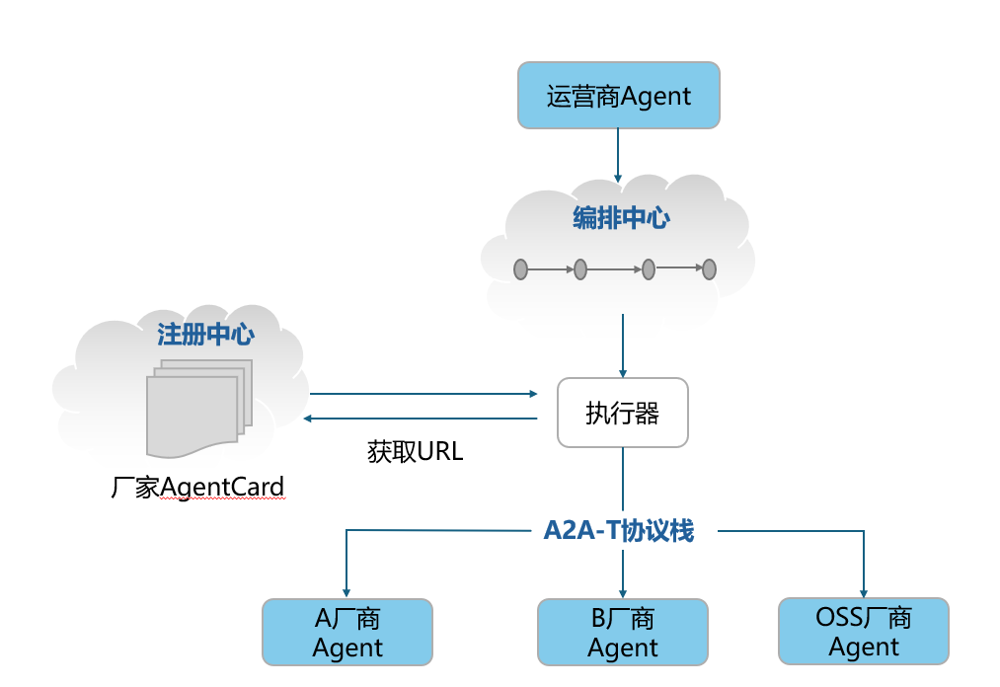
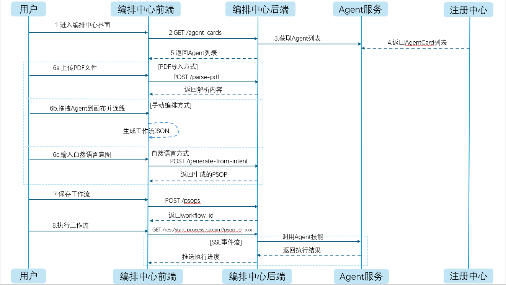

<!--
Copyright (c) 2026 Huawei Technologies Co., Ltd.
All Rights Reserved.

SPDX-License-Identifier: Apache-2.0

   Licensed under the Apache License, Version 2.0 (the "License"); you may
   not use this file except in compliance with the License. You may obtain
   a copy of the License at

        http://www.apache.org/licenses/LICENSE-2.0

   Unless required by applicable law or agreed to in writing, software
   distributed under the License is distributed on an "AS IS" BASIS, WITHOUT
   WARRANTIES OR CONDITIONS OF ANY KIND, either express or implied. See the
   License for the specific language governing permissions and limitations
   under the License.
-->
# 1 项目介绍

## 背景
从 2G 到 5G，移动通信网络经历了四代演进，网络规模和复杂度呈指数级增长。传统依赖大量人力的运维模式面临运营成本高、用户体验压力大、业务创新乏力的挑战。 2019 年起，全球领先运营商开始推动自智网络（Autonomous Network, AN）理念——让网络从"人工操作"走向"自动执行"，最终实现"自主治理"，并将网络自治水平分为L1-L5。
AN L4 的核心特征是：在特定场景下实现端到端闭环自治，而要实现 L4，就必须解决多厂商、跨层、跨域的智能体互联协作问题。当前业界虽然有通用的智能体协议（如A2A协议）和编排工具（如LangGraph）解决智能体互联协作问题，但在通信领域应用存在网络运维安全风险、运维工程师编码复杂、运维知识和工具复用难等问题，因此OpenAN应运而生。

## 核心愿景

OpenAN是一个自智网络开源项目集，通过一系列开源项目支撑通信智能体的开发和部署，使能多厂商、跨层、跨域集成，加速自智网络迈向L4-L5。

- 端到端闭环自治网络：加速电信专属智能体的跨层、跨域对接集成和上线部署，多智能体高效编排与协同，使能全球运营商加速实现AN L4。

- 厂商中立与开放生态：基于行业标准（价值场景Solution Package、智能体互联协议等），推进厂商中立、产业共享的场景化“技能、组件、知识和实践”，围绕AN形成电信全产业合作生态，共同提升产业AN水平。

- 行业主导与未来演进：推动OpenAN成为电信行业事实标准，探索面向AN L5下一代智能化系统的集成与协作。

## 项目架构

OpenAN 包含 6 个模块，构成了完整的智能体协作框架：

1 、A2A-T（Agent2Agent-Telecom）SDK：提供Agent交互之间的意图模板，校验消息合法性，提供消息压缩机制，提升交互效率。

2、注册与编排：提供AgentCard的注册管理能力，按意图匹配Skill，提供多个功能侧agent流程编排能力。

3、场景化实践：运营商/厂商分享场景化实践（Solution package），其他运营商可以获取参考，改造运行。

4、执行引擎：负责对上解析上层Agent意图，按照workflow执行，或自生成规划步骤，按需调用通信技能库。

5、通信策略演进：负责对模型生成的步骤进行评价，牵引模型提示框架持续改进。

6、通信技能与组件库：负责各种场景下的技能、组件、知识等，运营商、厂商分享贡献。

> **说明**：OpenAN首次开源发布 A2A-T SDK、注册与编排、场景化实践模块，其他模块后续版本持续演进。


# 2 软件安装指南

整体软件安装流程如下：

![[photo]](figures/installflow.png)

## 2.1 系统要求

本项目基于 Python 3.12 开发，编译安装前请确保目标系统满足以下要求：

### 操作系统

| 操作系统 | 最低版本 |
|---------|---------|
| 其他 Linux 发行版 | 内核 3.10+ |
| CentOS / RHEL | 7.0+ |
| Ubuntu | 18.04+ |
| Debian | 10+ |
> **说明**：Python 3.12 编译需要支持 C11 标准的编译器，GCC 5.0+ 可提供更好的优化支持。Glibc 2.17 是 Python 3.12 的最低要求，建议使用 2.28+ 以获得更好的兼容性。


###  验证系统环境

```bash
# 检查 GCC 版本
gcc --version

# 检查 Make 版本
make --version

# 检查 Glibc 版本
ldd --version
```

| 工具 | 最低版本 | 推荐版本 | 查看命令 |
|-----|---------|---------|---------|
| GCC | 4.8.5 | 5.0+ | `gcc --version` |
| Make | 3.81 | 4.0+ | `make --version` |
| Glibc | 2.17 | 2.28+ | `ldd --version` |
> **说明**：Python 3.12 编译需要支持 C11 标准的编译器，GCC 5.0+ 可提供更好的优化支持。Glibc 2.17 是 Python 3.12 的最低要求，建议使用 2.28+ 以获得更好的兼容性。

### 硬件部署建议资源
| 节点类型   | 主节点数量 | 从节点数量 | vCPU(个) | 内存(GB) | 硬盘        |
|--------|-------|-------|---------|--------|-----------|
| 注册中心节点 | 1     | 1     | 2       | 4      | 系统盘>=100G |
| 编排中心节点 | 1     | 1     | 2       | 4      | 系统盘>=100G |
| 数据库节点  | 1     | 1     | 2       | 4      | 系统盘>=100G |


### 最小部署建议资源
| 节点类型   | 主节点数量 | 从节点数量 | vCPU(个) | 内存(GB) | 硬盘       |
|--------|-------|-------|---------|--------|----------|
| 注册中心节点 | 1     | 0     | 1       | 2      | 系统盘>=50G |
| 编排中心节点 | 1     | 0     | 1       | 2      | 系统盘>=50G |
| 数据库节点  | 1     | 0     | 1       | 2      | 系统盘>=50G |


### 节点要求

节点可以连通外部网络。<br>
节点可以使用root用户登录。<br>
引导节点上需要安装tar工具。
> **须知**：建议您的节点环境足够干净，未安装任何Kubernetes组件，否则可能会发生版本冲突导致安装失败。


---

## 2.2 依赖安装

本项目基于 Python 3.12 开发，编译安装前请确保相关组件依赖满足以下要求：

| 组件       | 版本       | 说明       | 官网下载链接                                                     |
| ---------- | ---------- |----------| ---------------------------------------------------------------- |
| Python     | >= 3.12.11 | 项目开发语言   | https://www.python.org/ftp/python/3.12.11/Python-3.12.11.tgz     |
| PostgreSQL | >= 15.6    | 数据库存储服务  | https://ftp.postgresql.org/pub/source/v15.6/postgresql-15.6.tar.gz |
| NodeJS     | >= 20.19 | 编排中心前端依赖 | https://nodejs.org/dist/v22.19.0/node-v22.19.0-linux-x64.tar.xz   |

> 各组件离线安装指导如下，如果系统已有组件且版本已满足则可跳过此指导步骤。数据库此处以PostgreSQL为例，用户可根据实际场景选择数据库。

### 2.2.1 Python离线安装步骤

先检查环境上是否已安装python，版本是否为3.12.11，如果是则跳过如下安装步骤。
```bash
python3 --version   # 检查python版本
```


1.下载安装包。

在可接通网络的Linux服务器上执行以下命令获取安装包，Windows系统则直接访问网页下载获取。

```bash
wget https://www.python.org/ftp/python/3.12.11/Python-3.12.11.tgz
```

将 `Python-3.12.11.tgz` 传输到目标服务器。

2.解压安装包。

```bash
tar -xzf Python-3.12.11.tgz
cd Python-3.12.11
```

3.配置安装路径。

```bash
# 安装到 /usr/local/python312，避免覆盖系统Python
./configure --prefix=/usr/local/python312 --enable-optimizations
```

4.编译安装。

```bash
make -j 4
sudo make altinstall
```

5.创建软链接。

```bash
# 创建python3软链接
sudo ln -sf /usr/local/python312/bin/python3 /usr/local/bin/python3

# 创建pip3软链接
sudo ln -sf /usr/local/python312/bin/pip3 /usr/local/bin/pip3
```

6.验证安装。

```bash
python3 --version   # 应输出 Python 3.12.11
pip3 --version
```

**注意事项**

- 安装路径 `/usr/local/python312` 不影响系统自带Python。
- 软链接放在 `/usr/local/bin`，优先级低于 `/usr/bin`。
- 系统自带的 `python` 或 `python2` 命令保持不变。

### 2.2.2 数据库离线安装步骤
默认使用PostgreSQL数据库，用户可根据实际场景选择其他数据库，以下指导以PostgreSQL为例：

先检查环境上是否已安装PostgreSQL，版本是否为15.6，如果是则跳过如下安装步骤。
```bash
psql --version
```

1.下载安装包。

在可接通网络的Linux服务器上执行以下命令获取安装包，Windows系统则直接访问网页下载获取。

```bash
wget https://ftp.postgresql.org/pub/source/v15.6/postgresql-15.6.tar.gz
```

将 `postgresql-15.6.tar.gz` 传输到目标服务器。

2.解压安装包。

```bash
tar -xzf postgresql-15.6.tar.gz
cd postgresql-15.6
```

3.配置安装路径。

```bash
# 安装到 /usr/local/pgsql
./configure --prefix=/usr/local/pgsql --without-readline
```

常用配置选项：
- `--prefix=/usr/local/pgsql`: 指定安装路径。
- `--with-openssl`: 启用SSL支持。
- `--with-readline`: 启用readline支持（默认启用）。
- `--with-zlib`: 启用zlib支持（默认启用）。

4.编译安装。

```bash
make -j 4
sudo make install
```

5.创建postgres用户。

```bash
sudo useradd postgres
```

6.创建数据目录并授权。

```bash
sudo mkdir -p /usr/local/pgsql/data
sudo chown -R postgres:postgres /usr/local/pgsql/data
```

7.初始化数据库。

```bash
su - postgres # 切换至postgres用户
/usr/local/pgsql/bin/initdb -D /usr/local/pgsql/data
```

8.启动PostgreSQL服务。

```bash
# 切换至postgres用户
su - postgres

# 前台启动
/usr/local/pgsql/bin/pg_ctl -D /usr/local/pgsql/data -l /usr/local/pgsql/data/logfile start

# 添加系统环境变量
echo "export PATH=/usr/local/pgsql/bin:\$PATH" >> ~/.bashrc
source ~/.bashrc

# 确认启动成功
psql -l

# 检查版本
/usr/local/pgsql/bin/psql --version

# 连接数据库
/usr/local/pgsql/bin/psql -c "SELECT version();"
```

退出`postgres`用户可输入`exit`。

9.配置systemd服务（可选）。

```bash
sudo tee /etc/systemd/system/postgresql.service << EOF
[Unit]
Description=PostgreSQL 15 Database Server
After=network.target

[Service]
Type=forking
User=postgres
Group=postgres
Environment=PGDATA=/usr/local/pgsql/data
ExecStart=/usr/local/pgsql/bin/pg_ctl start -D /usr/local/pgsql/data -l /usr/local/pgsql/data/logfile
ExecStop=/usr/local/pgsql/bin/pg_ctl stop -D /usr/local/pgsql/data
ExecReload=/usr/local/pgsql/bin/pg_ctl reload -D /usr/local/pgsql/data
PIDFile=/usr/local/pgsql/data/postmaster.pid
TimeoutSec=300

[Install]
WantedBy=multi-user.target
EOF

sudo systemctl daemon-reload
sudo systemctl enable postgresql
sudo systemctl start postgresql
```

10.创建数据库和用户。

```bash
# 切换至postgres用户
su - postgres

# 进入sql交互界面
psql
```

在psql中执行：

```sql
CREATE USER registry_user WITH ENCRYPTED PASSWORD 'your_password' CREATEDB;
```

11.配置远程访问（使用root用户）。

- 编辑 `/usr/local/pgsql/data/pg_hba.conf`，在末尾添加：

```bash
# 添加允许远程连接
host    all             all             0.0.0.0/0               scram-sha-256
```

- 编辑 `/usr/local/pgsql/data/postgresql.conf`：

```bash
# 修改监听地址
listen_addresses = '*'
```

- 重启服务：

```bash
# 使用systemctl重启（推荐）
sudo systemctl restart postgresql

# 或重启数据库配置
su - postgres -c "/usr/local/pgsql/bin/pg_ctl -D /usr/local/pgsql/data restart"
```

**注意事项**

- PostgreSQL 默认使用端口 5432。
- 生产环境请务必修改默认密码。
- 配置防火墙规则限制数据库访问。
- 建议定期备份数据库。

### 2.2.3 NodeJS离线安装步骤
先检查环境上是否已安装NodeJS，版本是否为22.19.0，如果是则跳过如下安装步骤。
```bash
node --version   # 应输出 v22.19.0
```
1.下载安装包。

在可接通网络的Linux服务器上执行以下命令获取安装包，Windows系统则直接访问网页下载获取

```bash
wget https://nodejs.org/dist/v22.19.0/node-v22.19.0-linux-x64.tar.xz
```

将 `node-v22.19.0-linux-x64.tar.xz` 传输到目标服务器。

2.解压安装包。

```bash
tar -xJf node-v22.19.0-linux-x64.tar.xz -C /usr/local/
mv /usr/local/node-v22.19.0-linux-x64 /usr/local/nodejs
```

3.配置环境变量。

```bash
# 添加NodeJS到系统环境变量
echo "export PATH=/usr/local/nodejs/bin:\$PATH" >> ~/.bashrc
source ~/.bashrc
```

4.验证安装。

```bash
node --version   # 应输出 v22.19.0
npm --version
```

**注意事项**

- NodeJS使用预编译二进制包，无需编译工具链。
- 默认安装路径为 `/usr/local/nodejs`。
- 生产环境建议使用nvm管理多个NodeJS版本。

---

## 2.3 注册中心服务安装步骤
![[photo]](figures/install-registry-center-flow.png)
1.获取源码。

```bash
git clone https://github.com/project-openan/registry-center.git
cd registry-center
```

2.创建虚拟环境。

```bash
# 使用已安装的Python 3.12创建虚拟环境
python3 -m venv venv --copies
```

3.激活虚拟环境。

```bash
# 激活虚拟环境
source venv/bin/activate
```

激活后，命令行前缀会显示 `(venv)`。

4.安装依赖。

```bash
# 激活虚拟环境后安装依赖
pip install -r ./requirements.txt
```

5.服务安装配置（可选）。

可在`./etc/systemd/deploy.conf`文件中配置服务部署目录等。

```bash
vi ./etc/systemd/deploy.conf

# Registry Center 部署配置
# Copyright (c) 2026 Huawei Technologies Co., Ltd.

# 部署目录（服务安装位置）
INSTALL_DIR=/OpenA2A-T/registry-center

# Python路径（留空则用  INSTALL_DIR/venv/bin/python3）
PYTHON_PATH=

# 服务名称
SERVICE_NAME=registry-center

# 是否自动安装依赖（推荐设置为true，使用pip安装）
INSTALL_DEPS=true
```

> 退出vi：按下Esc按键，输入:wq!


6.修改数据库连接配置。

修改注册中心配置文件： `./etc/conf/persistence.conf`

- 修改`postgresql.host`为数据库所在节点IP

- 修改`postgresql.port`为postgresql数据库端口号，默认为`5432`

- 用户名`postgresql.username`、密码`postgresql.password`按照数据库实际设置的情况进行修改

7.给脚本添加可执行权限。

```bash
# 给脚本添加可执行权限
chmod +x ./bin/*.sh
```

8.安装服务到指定目录。

```bash
# 安装服务到步骤2.3.5中指定的INSTALL_DIR目录
sudo ./bin/install_service.sh install

# 执行成功后将回显成功信息：
# Installing the project to /OpenA2A-T/registry-center...
# Files copied successfully
# Deploy Configuration:
#   Install Dir: /OpenA2A-T/registry-center
#   Python Path: /OpenA2A-T/registry-center/venv/bin/python3
#   Install Deps: false
# 
# Using Python: /OpenA2A-T/registry-center/venv/bin/python3
# Python 3.12.11
# Service installed successfully!
```

9.初始化服务配置。

```bash
# 进入服务安装目录
cd /OpenA2A-T/registry-center

# 初始化服务配置
./venv/bin/python3 -m agent_registry.init
```

服务支持HTTPS和AgentCard签名及验签能力，**首次启动可选择关闭，后续按需执行此章节进行配置**。

```bash
是否开启HTTPS enable_https (y/n, 默认: true): n
是否需要提供注册中心签名配置 registry.sign.enabled (y/n, 默认: true): n
是否开启验签能力 signature_validation_enabled (y/n, 默认: true): n

==================================================
持久化存储配置
==================================================

请选择存储模式 persistence.mode (file/postgresql, 默认: postgresql): file

配置已完成，已保存在 /OpenA2A-T/registry-center/etc/conf/server.conf
```

10.启动服务和状态管理。

```bash
# 启动服务
systemctl start registry-center

# 查看服务状态
systemctl status registry-center

# 停止服务
systemctl stop registry-center
```

11.服务状态日志查看。

```bash
# 查看所有日志
journalctl -u registry-center

# 实时追踪日志
journalctl -u registry-center -f
```

12.卸载服务。

```bash
# 从安装目录卸载服务
sudo ./bin/install_service.sh uninstall
```

---

## 2.4 编排中心服务安装步骤
![[photo]](figures/install-orchestration-center-flow.png)

1.获取源码。

```bash
git clone https://github.com/project-openan/orchestration-center.git
cd orchestration-center
```

2.创建虚拟环境。

```bash
# 使用已安装的Python 3.12创建虚拟环境
python3 -m venv venv --copies
```

3.激活虚拟环境。

```bash
# 激活虚拟环境
source venv/bin/activate
```

激活后，命令行前缀会显示 `(venv)`。

4.安装依赖。

```bash
# 激活虚拟环境后安装依赖
pip install -r ./requirements.txt
```

5.服务安装配置（可选）。

可在`./etc/systemd/deploy.conf`文件中配置服务部署目录等。

```bash
vi ./etc/systemd/deploy.conf

# Orchestration Center 部署配置
# Copyright (c) 2026 Huawei Technologies Co., Ltd.

# 部署目录（服务安装位置）
INSTALL_DIR=/OpenA2A-T/orchestration-center

# Python路径（留空则用  INSTALL_DIR/venv/bin/python3）
PYTHON_PATH=

# 服务名称
SERVICE_NAME=orchestration-center

# 是否自动安装依赖（推荐设置为true，使用pip安装）
INSTALL_DEPS=true
```

> 退出vi：按下Esc按键，输入:wq!

6.修改数据库连接配置。

修改编排中心配置文件： `./etc/conf/db_config.json`

- 修改`host`为PostgreSQL数据库所在节点IP

- 修改`port`为PostgreSQL数据库端口号，默认为`5432`

- 用户名`user`密码、`password`按照数据库实际设置的情况进行修改

7.给脚本添加可执行权限。

```bash
# 给脚本添加可执行权限
chmod +x ./bin/*.sh
```

8.安装服务到指定目录。

```bash
# 安装服务到步骤2.4.5中指定的INSTALL_DIR目录
sudo ./bin/install_service.sh install

# 执行成功后将回显成功信息：
# Installing the project to /OpenA2A-T/orchestration-center...
# Files copied successfully
# Deploy Configuration:
#   Install Dir: /OpenA2A-T/orchestration-center
#   Python Path: /OpenA2A-T/orchestration-center/venv/bin/python3
#   Install Deps: false
# 
# Using Python: /OpenA2A-T/orchestration-center/venv/bin/python3
# Python 3.12.11
# Service installed successfully!
```

9.初始化服务配置（需配置数据库）。

```bash
# 进入服务安装目录
cd /OpenA2A-T/orchestration-center

# 初始化服务配置，可配置服务端口，是否启用HTTPS等
vi ./etc/conf/server.conf
```

HTTPS 能力开发中，默认关闭。如需启用，请将 `enable_https` 改为 `true`，并确保已配置 SSL 证书后重启服务。

```bash
# 设置enable_https=false
:wq!
```

10.启动服务和状态管理。

```bash
# 启动服务
systemctl start orchestration-center

# 查看服务状态
systemctl status orchestration-center

# 停止服务
systemctl stop orchestration-center
```

11.服务状态日志查看。

```bash
# 查看所有日志
journalctl -u orchestration-center

# 实时追踪日志
journalctl -u orchestration-center -f
```

12.卸载服务。

```bash
# 从安装目录卸载服务
sudo ./bin/install_service.sh uninstall
```

---

## 2.5 编排中心前端离线安装步骤

前端代码已集成在编排中心代码仓中，完成[2.4章节](#24-编排中心服务安装步骤)后前端代码即已安装完成，只需启动前端服务即可。启动步骤如下：

进入编排中心安装目录下的 `workflow-designer` 目录：

```bash
cd {安装目录}/orchestration-center/workflow-designer
npm install --force
npm run dev
```

启动成功后，可通过浏览器访问 `http://localhost:3003` 进入编排中心前端界面。

---

## 2.6 A2A-T SDK 离线安装步骤

A2A-T SDK分为a2a-t-sdk-python和a2a-t-sdk-java两种，是 A2A-T 协议的 Python/Java 实现，a2a-t-sdk-python面向客户端 Agent 和服务端 Agent 提供任务提示词生成、提示词校验和多轮协商能力。a2a-t-sdk-java面向 Java Agent 提供客户端提示词生成、服务端提示词校验、协商运行时和 A2A Java 集成样例。

- a2a-t-sdk-python

[安装和配置方式见 Python SDK 的用户指南](https://github.com/project-openan/a2a-t-sdk-python/blob/main/docs/zh/%E7%94%A8%E6%88%B7%E6%8C%87%E5%8D%97.md)

Python SDK 源码位于 `a2a-t-sdk-python` 仓库，端到端演示样例位于 `a2a-t-samples` 仓库。SDK 运行前需准备 Python 3.12+，并配置可用的 LLM 服务地址和 API Key。

- a2a-t-sdk-java

[安装和配置方式见 Java SDK 的用户指南](https://github.com/project-openan/a2a-t-sdk-java/blob/main/docs/zh/%E7%94%A8%E6%88%B7%E6%8C%87%E5%8D%97.md)

Java SDK 源码和示例均位于 `a2a-t-sdk-java` 仓库。运行前需准备 JDK 17+、Maven，并配置可用的 LLM 服务地址和 API Key。

---

# 3 快速入门

## 3.1 注册中心和编排中心



注册中心是一个专注于Agent统一管理的服务，支持用户将来自不同厂商的Agent进行集中注册与管理，实现多源Agent的可控接入与维护。主要功能包括：

- **注册AgentCard**：支持将不同厂商的Agent注册到中心，统一纳管。
- **查询AgentCard列表**：根据指定条件查询符合条件的AgentCard列表。
- **查询指定AgentCard**：按AgentCard名称和组织精确查找唯一的AgentCard实例。
- **更新指定AgentCard**：更新指定AgentCard的信息。
- **删除指定AgentCard**：删除不再使用的AgentCard。
- **按语义检索AgentCard**：根据自然语言语义检索相匹配的AgentCard。

通过这些功能，注册中心可以帮助用户高效整合、维护与发现各类 Agent，为上层编排与协同提供基础能力。

编排中心是一个面向多智能体（Agent）协作的可视化编排平台，支持通过图形化工作流设计器定义 Agent 之间的调用关系与执行流程。后端基于 Python 框架解析流程并驱动 Agent 协同工作，帮助用户高效构建、管理和运行复杂的 Agent 协作流程。主要功能包括：

- **PSOP(Parallel Standard Operating Procedure)管理**：支持工作流（PSOP）的列表查看、详情查询、保存与删除操作。
- **PDF 解析**：提供 PDF 文件内容解析能力，为后续流程设计提供数据支持。
- **智能规划**：根据用户需求自动生成工作流规划，降低编排门槛。
- **Agent 管理**：获取全量 AgentCard 列表，便于了解可用能力与调用方式。
- **自然语言生成 PSOP**：通过自然语言意图直接生成可执行的编排流程。
- **意图检索 PSOP**：根据自然语言描述，检索匹配的历史工作流。
- **实时流程执行**：支持以流式方式启动 PSOP 执行，并实时推送运行进展，便于监控与调试。

### 3.1.1 启动服务
#### 3.1.1.1 启动注册中心服务
[启动方式见注册中心的用户指南](https://github.com/project-openan/registry-center/blob/main/docs/zh/%E6%B3%A8%E5%86%8C%E4%B8%AD%E5%BF%83%E7%94%A8%E6%88%B7%E6%8C%87%E5%8D%97.md#%E5%90%AF%E5%8A%A8cli)

#### 3.1.1.2 启动编排中心后端服务
[启动方式见编排中心的用户指南](https://github.com/project-openan/orchestration-center/blob/main/docs/zh/%E7%94%A8%E6%88%B7%E6%8C%87%E5%8D%97.md#222-%E5%90%AF%E5%8A%A8%E7%BC%96%E6%8E%92%E4%B8%AD%E5%BF%83%E5%90%8E%E7%AB%AF%E6%9C%8D%E5%8A%A1)

#### 3.1.1.3 启动编排中心前端界面
[启动方式见编排中心的用户指南](https://github.com/project-openan/orchestration-center/blob/main/docs/zh/%E7%94%A8%E6%88%B7%E6%8C%87%E5%8D%97.md#223-%E5%AE%89%E8%A3%85%E5%89%8D%E7%AB%AF%E4%BE%9D%E8%B5%96%E5%B9%B6%E5%90%AF%E5%8A%A8)

### 3.1.2 示例Agent介绍
 	 
本章节以赛事直播保障场景为例，介绍多个Agent如何协同工作，实现端到端的闭环自治。
 	 
**场景背景**

在赛事直播场景中，需要保证直播过程的网络稳定，确保观众获得流畅的观看体验。该场景涉及Live Streaming Agent、Assurance Agent和RAN Agent三个智能体的协作。
 	 
**Agent角色说明**
 	 
| Agent名称 | 职责 |
| --- | --- |
| Live Streaming Agent | 负责赛事需求的解析与监控 |
| Assurance Agent | 负责保障策略及其恢复策略的生成 |
| RAN Agent | 负责无线网络的分析、规划与策略执行 |
 	 
**协作流程**
  
  整个赛事直播保障流程分为保障执行和保障恢复两个阶段：

- 阶段一：保障执行流程
```mermaid
 	 flowchart LR
 	     A[Live Streaming Agent<br/>提取赛事路线和业务需求] --> B[Live Streaming Agent<br/>下发需求给Assurance Agent]
 	     B --> C[Assurance Agent<br/>将赛事保障需求转换为网络需求]
 	     C --> D[Assurance Agent<br/>下发网络需求给RAN Agent]
 	     D --> E[RAN Agent<br/>分析网络现状]
 	     E --> F[RAN Agent<br/>规划网络策略方案]
 	     F --> G[RAN Agent<br/>执行网络策略方案]
 	     G --> H[Live Streaming Agent<br/>实时反馈KQI指标及任务状态]
 ```
- 阶段二：保障恢复流程
```mermaid
 	 flowchart LR
 	     H[Live Streaming Agent<br/>实时反馈KQI指标及任务状态] --> I[Assurance Agent<br/>下发恢复网络配置指令]
 	     I --> J[RAN Agent<br/>执行网络配置恢复]
 ```
 	 
以下视频展示了赛事直播保障场景中多Agent协作的完整流程，涵盖保障执行与保障恢复两个阶段：


### 3.1.3 启动示例 Agent
为了快速体验完整流程，可以启动项目自带的示例 Agent 服务。
```bash
cd {项目路径}/orchestration-center/samples
python -m samples.start_agents_server
```
该脚本会：
- 向注册中心注册多个示例 Agent。
- 启动对应的 Agent 服务，供编排中心调用。
### 3.1.4 核心流程验证
完成上述步骤后，您可以按照以下流程体验 OpenAN 的核心能力：



1. 访问编排中心界面。

打开浏览器访问 `http://localhost:3003`

2.  配置服务地址。

单击界面右上角的齿轮图标，将后端 IP 和端口修改为编排中心后端的实际地址，保存。

3. 查看 Agent 库。

左侧展示从注册中心获取的所有 Agent，可通过名称或功能进行搜索。

4. 创建工作流。
   
单击 `+` 按钮，选择创建方式：([具体创建流程见编排中心用户指南](https://github.com/project-openan/orchestration-center/blob/main/docs/zh/%E7%94%A8%E6%88%B7%E6%8C%87%E5%8D%97.md#3-%E4%BD%BF%E7%94%A8))

| 方式 | 操作说明 |
| --- | --- |
| PDF 导入 | 上传 PDF 文件，系统自动解析并生成 PSOP |
| 手动编排 | 将 Agent 卡片拖拽到画布，通过连线定义执行顺序 |
| 自然语言生成 | 输入业务意图描述，后台自动编排生成 PSOP |

5. 执行工作流
- 输入用户意图，单击“检索工作流”按钮
- 选择匹配的 PSOP
- 单击 `▶` 按钮执行，右侧区域实时显示执行过程

## 3.2 A2A-T SDK

### 3.2.1 a2a-t-sdk-python

a2a-t-sdk-python 是 A2A-T 协议的 Python 实现，面向客户端 Agent 和服务端 Agent 提供任务提示词生成、提示词校验和多轮协商能力。主要功能包括：

- **任务提示词生成**：客户端根据用户自然语言或结构化输入生成 A2A-T processed task prompt。
- **任务提示词校验**：服务端校验 processed task prompt 的场景、模板、槽位和语义一致性。
- **多轮协商**：支持 information、clarification、feasibility、fulfillment 四类协商流程。
- **提示词资源管理**：支持本地场景、槽位、模板和系统提示词资源加载。
- **LLM 适配**：通过 OpenAIClient 方式接入外部大模型。

通过这些能力，Python SDK 可以帮助开发者快速构建符合 A2A-T 交互规范的 Python Agent，并与 A2A 协议链路、注册中心和编排中心配合集成。

详细说明见：

- [Python SDK 用户指南](https://github.com/project-openan/a2a-t-sdk-python/blob/main/docs/zh/%E7%94%A8%E6%88%B7%E6%8C%87%E5%8D%97.md)
- [Python SDK 开发指南](https://github.com/project-openan/a2a-t-sdk-python/blob/main/docs/zh/%E5%BC%80%E5%8F%91%E6%8C%87%E5%8D%97.md)

### 3.2.2 a2a-t-sdk-java

a2a-t-sdk-java 是 A2A-T 协议的 Java 实现，面向 Java Agent 提供客户端提示词生成、服务端提示词校验、协商运行时和 A2A Java 集成样例。主要功能包括：

- **客户端提示词生成**：通过 `A2ATClient` 生成 A2A-T processed task prompt。
- **服务端提示词校验**：通过 `A2ATServer` 校验 prompt 的场景、槽位和语义一致性。
- **协商流程**：支持多轮信息补充、澄清、可行性确认和履约确认。
- **Maven 多模块工程**：按 core、resources、llm、prompt、negotiation、client、server、sample 分层组织。

通过这些能力，Java SDK 可以帮助开发者在 Java Agent 中复用 A2A-T 的任务表达、校验和协商能力，并通过注册中心发现目标 Agent。

详细说明见：

- [Java SDK 用户指南](https://github.com/project-openan/a2a-t-sdk-java/blob/main/docs/zh/%E7%94%A8%E6%88%B7%E6%8C%87%E5%8D%97.md)
- [Java SDK 开发指南](https://github.com/project-openan/a2a-t-sdk-java/blob/main/docs/zh/%E5%BC%80%E5%8F%91%E6%8C%87%E5%8D%97.md)
