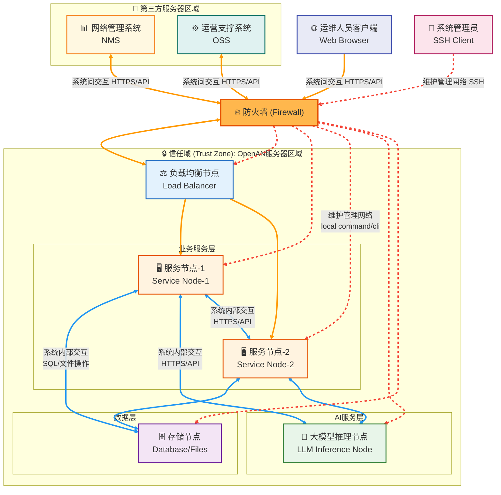

# OpenAN 安全技术白皮书

## 目录

1. [概述](#概述)
2. [安全架构设计](#安全架构设计)
3. [组网安全](#组网安全)
4. [平台安全](#平台安全)
5. [应用安全](#应用安全)
6. [数据安全](#数据安全)
7. [安全运维最佳实践](#安全运维最佳实践)
8. [安全审计与监控](#安全审计与监控)
9. [安全事件响应](#安全事件响应)
10. [安全合规性](#安全合规性)
11. [设计约束与限制](#设计约束与限制)
12. [附录](#附录)

---

## 概述

### 项目介绍

OpenAN是一个自智网络开源项目集，通过一系列开源项目支撑通信智能体的开发和部署，使能多厂商、跨层、跨域集成，加速自智网络迈向L4-L5，[详见“OpenAN快速入门”的项目介绍章节](./OpenAN快速入门.md#1-项目介绍)。

本白皮书面向开源社区使用者、架构师及设计角色，阐述 OpenAN 的安全技术架构、安全机制及安全最佳实践。

### 安全目标

OpenAN 的安全设计遵循以下核心目标：

| 安全目标 | 描述 |
|---------|------|
| **机密性** | 保护敏感数据不被未授权访问，包括传输加密和存储加密 |
| **完整性** | 确保数据在传输和存储过程中不被篡改，提供签名验签机制 |
| **可用性** | 保证服务的稳定运行，具备故障恢复和容灾能力 |
| **可审计性** | 记录关键操作日志，支持安全事件的追溯和分析 |
| **最小权限** | 组件和服务以最小必要权限运行，降低安全风险 |

### 适用读者

- 系统架构师：了解 OpenAN 安全架构设计，进行系统集成规划
- 安全工程师：评估 OpenAN 安全能力，制定安全加固方案
- 运维人员：参考安全配置和运维最佳实践
- 开发者：理解安全机制，进行安全合规开发

---

## 安全架构设计

### 整体安全架构

OpenAN 采用分层安全架构模型，从组网安全、平台安全、应用安全三个层次构建纵深防御体系：

```
┌─────────────────────────────────────────────────────────┐
│                    应用安全层                            │
│  ┌─────────────┐ ┌─────────────┐ ┌─────────────┐        │
│  │ 传输加密     │ │ 认证鉴权    │ │ 日志审计     │        │
│  └─────────────┘ └─────────────┘ └─────────────┘        │
│  ┌─────────────┐ ┌─────────────┐ ┌─────────────┐        │
│  │ 数据保护     │ │ 接口防护    │ │ 签名验签     │        │
│  └─────────────┘ └─────────────┘ └─────────────┘        │
├─────────────────────────────────────────────────────────┤
│                    平台安全层                            │
│  ┌─────────────┐ ┌─────────────┐ ┌─────────────┐        │
│  │ 系统加固     │ │ 安全补丁    │ │ 防病毒       │        │
│  └─────────────┘ └─────────────┘ └─────────────┘        │
├─────────────────────────────────────────────────────────┤
│                    组网安全层                            │
│  ┌─────────────┐ ┌─────────────┐ ┌─────────────┐        │
│  │ 安全域划分   │ │ 防火墙隔离  │ │ 网络隔离     │        │
│  └─────────────┘ └─────────────┘ └─────────────┘        │
└─────────────────────────────────────────────────────────┘
```


### 安全威胁模型

OpenAN 针对以下主要安全威胁进行了防护设计：

| 威胁类型 | 威胁描述 | 防护措施 |
|---------|---------|---------|
| 未授权访问 | 外部系统或用户未经授权访问 OpenAN 服务 | 认证机制、防火墙策略、网络隔离 |
| 数据泄露 | 敏感数据在传输或存储过程中被窃取 | TLS 加密、敏感数据脱敏、访问控制 |
| 数据篡改 | AgentCard 或配置数据被恶意修改 | 签名验签机制、完整性校验 |
| 拒绝服务 | 攻击者通过大量请求消耗系统资源 | 流量控制、请求大小限制 |
| 提权攻击 | 服务进程获取更高权限执行恶意操作 | 非 root 运行、最小权限原则 |
| 中间人攻击 | 通信数据在传输过程中被拦截篡改 | TLS 双向认证、证书校验 |


---

## 组网安全

### 部署模式

OpenAN 当前仅支持 **OP（On-Premise）部署模式**，不对公网开放。系统部署于客户内网环境，通过安全域划分、防火墙隔离、内外部通信网络隔离等技术方案提供防护。

### 安全域划分

根据不同风险级别划分如下安全区域：

| 安全区域 | 风险级别 | 部署内容 | 防护要求 |
|---------|---------|---------|---------|
| **OpenAN 服务器区域** | 高（信任域） | 注册中心、编排中心、数据库、LLM 推理节点 | 严格访问控制，仅允许授权访问 |
| **第三方服务器区域** | 中 | NMS、OSS、3A 服务器等外部系统 | 通过防火墙与信任域隔离 |
| **运维人员客户端接入区域** | 中低 | Web 浏览器访问终端 | HTTPS 加密访问，身份认证 |
| **系统管理员接入区域** | 中低 | SSH 管理终端 | SSH 加密，特权账号管理 |

### 组网建议

以下为 OpenAN 组网建议示例，完整的安全组网由客户根据实际环境制定：



### 防火墙策略

不同安全区域之间通过防火墙进行隔离防护。防火墙配置应遵循以下原则：

#### 基本策略

| 策略类型 | 说明 |
|---------|------|
| **默认拒绝** | 默认拒绝所有跨域流量，仅显式允许合法流量 |
| **最小开放** | 仅开放业务必需的端口和协议 |
| **双向控制** | 对入站和出站流量均实施访问控制 |
| **日志记录** | 记录所有防火墙事件，支持审计追溯 |

#### 访问控制列表（Access Control List, ACL） 策略类型

| 策略类型 | 控制粒度 | 适用场景 |
|---------|---------|---------|
| **基本控制策略** | 指定源 IP 地址的允许或禁止 | 管理网络访问控制 |
| **扩展访问控制策略** | 五元组（源地址、目的地址、源端口、目的端口、协议） | 业务服务精细化控制 |

#### 端口开放建议

入站流量：

| 服务 | 端口 | 协议 | 访问来源 |
|------|------|------|---------|
| 注册中心服务 | 按配置（默认 HTTPS） | HTTPS | 运维客户端、编排中心 |
| 编排中心后端 | 按配置（默认 HTTPS） | HTTPS | 运维客户端 |
| 编排中心前端 | 3003 | HTTP | 运维客户端（内网） |
| PostgreSQL | 5432 | TCP | OpenAN 服务节点 |
| SSH 管理 | 22 | SSH | 系统管理员区域 |

出站流量：1024~65535


### 内外部通信隔离

OpenAN 服务节点接收来自不同来源的请求，通过网络平面隔离降低安全风险：

| 网络平面 | 开放位置 | 请求来源 | 安全风险 | 防护级别 |
|---------|---------|---------|---------|---------|
| **外部网络平面** | 外部 IP | 第三方系统、运维客户端 | 较高 | 高级别防护（TLS、认证） |
| **内部网络平面** | 内部 IP | 内部服务间交互 | 较低 | 基础防护 |
| **管理网络平面** | localhost (UDS) | 系统管理员后台管理 | 最低 | 本地权限控制 |

**防护措施**：

- 外部网络平面：必须启用 TLS 加密、身份认证、请求校验
- 内部网络平面：建议启用 TLS 加密、服务间认证
- 管理网络平面：严格控制访问权限，防止提权攻击


---

## 平台安全

平台安全通过系统加固、安全补丁、防病毒等手段提升操作系统安全级别，为应用层提供安全可靠的运行平台。

### 系统加固

#### 加固目标

| 目标 | 说明 |
|------|------|
| **最小化原则** | 仅开放业务必需的端口、权限和服务 |
| **专用性原则** | 针不同操作系统提供专门的安全加固策略 |
| **适用性原则** | 加固策略经过严格测试，不影响业务运行 |
| **可审计原则** | 安全策略变更可追溯，支持审计回溯 |

#### 加固策略清单

| 类别 | 加固项 | 说明 |
|------|--------|------|
| **系统服务** | 禁用不必要服务 | 关闭非业务必需的系统服务 |
| **文件权限** | 最小权限设置 | 配置文件和目录的最小访问权限 |
| **内核配置** | 安全参数调整 | 内核参数安全配置（如禁用 core dump） |
| **协议配置** | 网络协议加固 | TCP/IP 协议栈安全参数配置 |
| **访问控制** | 权限边界设置 | 文件系统访问控制策略 |
| **账号安全** | 口令策略配置 | 强密码策略、账号锁定策略 |
| **日志审计** | 审计策略启用 | 系统操作日志记录 |
| **补丁检查** | 定期更新 | 定期检查并安装安全补丁 |

#### History 命令处理

系统务必默认关闭 history 命令：

```bash
# 禁用 history 命令示例
unset HISTFILE
# 或设置历史记录忽略敏感命令
export HISTIGNORE='*password*:*secret*:*key*'
```

---

## 应用安全

应用安全涵盖传输安全、认证鉴权、日志审计、接口防护等机制，保障业务层面的安全。

### 传输安全

#### 传输层安全协议(Transport Layer Security, TLS) 加密通信

| 组件 | 加密要求 | 说明 |
|------|---------|------|
| 服务间通信 | TLS 1.2 / TLS 1.3 | 注册中心与编排中心之间 |
| 数据库访问 | SSL 连接（TLS 1.2+） | PostgreSQL 连接加密 |
| API 接口 | HTTPS（TLS 1.2 / TLS 1.3） | 对外服务接口强制 HTTPS |
| LLM 接口 | HTTPS（TLS 1.2 / TLS 1.3） | 与大模型推理节点通信加密 |

#### TLS 协议版本要求

| 协议版本 | 支持状态 | 说明 |
|---------|---------|------|
| **TLS 1.3** | 推荐 | 最新标准，安全性最高，性能更优 |
| **TLS 1.2** | 支持 | 广泛兼容，安全性良好 |
| **TLS 1.1** | 禁用 | 已弃用，存在安全风险 |
| **TLS 1.0** | 禁用 | 已弃用，存在安全风险 |
| **SSL v3** | 禁用 | 已弃用，存在严重安全漏洞（POODLE） |
| **SSL v2** | 禁用 | 已弃用，存在严重安全漏洞 |

#### TLS 加密算法套件要求

**TLS 1.3 推荐算法套件**（优先使用）：

| 算法套件名称 | 说明 |
|-------------|------|
| `TLS_AES_256_GCM_SHA384` | AES-256-GCM 加密，SHA-384 消息认证 |
| `TLS_AES_128_GCM_SHA256` | AES-128-GCM 加密，SHA-256 消息认证 |
| `TLS_CHACHA20_POLY1305_SHA256` | ChaCha20-Poly1305 加密，适用于移动设备 |

**TLS 1.2 推荐算法套件**：

| 算法套件名称 | 说明 |
|-------------|------|
| `TLS_ECDHE_RSA_WITH_AES_256_GCM_SHA384` | ECDHE 密钥交换，RSA 认证，AES-256-GCM 加密 |
| `TLS_ECDHE_RSA_WITH_AES_128_GCM_SHA256` | ECDHE 密钥交换，RSA 认证，AES-128-GCM 加密 |
| `TLS_ECDHE_ECDSA_WITH_AES_256_GCM_SHA384` | ECDHE 密钥交换，ECDSA 认证，AES-256-GCM 加密 |
| `TLS_ECDHE_ECDSA_WITH_AES_128_GCM_SHA256` | ECDHE 密钥交换，ECDSA 认证，AES-128-GCM 加密 |
| `TLS_ECDHE_RSA_WITH_CHACHA20_POLY1305_SHA256` | ECDHE 密钥交换，ChaCha20-Poly1305 加密 |

**禁用的算法套件**：

| 禁用算法套件 | 禁用原因 |
|-------------|---------|
| 使用 `DES`、`3DES` 的套件 | 加密强度不足，存在 SWEET32 攻击风险 |
| 使用 `RC4` 的套件 | 流加密已被证明不安全 |
| 使用 `CBC` 模式的套件 | 存在 BEAST、Lucky13 等攻击风险 |
| 使用 `MD5` 的套件 | 哈希算法已被证明不安全 |
| 使用 `SHA-1` 的套件 | 哈希算法已被证明存在碰撞风险 |
| 使用静态 `RSA` 密钥交换的套件 | 不支持前向保密（Forward Secrecy） |
| 使用 `DH`（< 2048 位）的套件 | 密钥长度不足，存在 Logjam 攻击风险 |


### 认证与鉴权

#### 认证机制

| 认证方式 | 适用场景 | 说明 |
|---------|---------|------|
| **证书认证** | TLS 双向认证 | 高安全场景的服务间认证 |
| **Token 认证** | API 接口 | 可扩展的接口认证机制 |
| **数据库认证** | PostgreSQL | 用户名/密码认证，scram-sha-256 加密 |


#### 鉴权机制

| 鉴权维度 | 说明 |
|---------|------|
| **接口鉴权** | API 接口访问权限控制，可扩展的接口鉴权机制 |
| **数据鉴权** | 数据访问范围限制 |
| **操作鉴权** | 操作类型权限控制 |

### 接口防护

#### HTTP 请求限制

| 限制项 | 默认值 | 说明 |
|--------|--------|------|
| **请求大小** | 2MB | 防止大请求消耗资源 |
| **请求频率** | 可配置 | 防止请求洪泛攻击 |
| **连接超时** | 可配置 | 防止连接占用 |

#### 输入校验

| 校验项 | 说明 |
|--------|------|
| **参数校验** | API 参数类型、范围、格式校验 |
| **注入防护** | SQL 注入、命令注入防护 |
| **格式校验** | JSON 格式校验、AgentCard 格式校验 |


### 运行安全

| 安全项 | 要求 | 说明 |
|--------|------|------|
| **运行用户** | 非 root | 服务以普通用户身份运行 |
| **文件权限** | 最小权限 | 配置文件权限最小化 |
| **提权防护** | 禁止提权 | 不执行 sudo 或提权操作 |
| **进程隔离** | 独立进程 | 服务进程相互隔离 |

---

## 数据安全

### AgentCard 安全

#### AgentCard 内容限制

AgentCard 中不可含有以下内容：

| 禁止内容 | 说明 |
|---------|------|
| **敏感数据** | 密码、密钥、Token 等 |
| **机密数据** | 商业机密、内部机密信息 |
| **个人信息** | 用户姓名、联系方式、身份信息 |

#### AgentCard 完整性保护

注册中心提供 AgentCard 签名与验签机制：

| 功能 | 说明 |
|------|------|
| **签名机制** | 注册时对 AgentCard 进行数字签名 |
| **验签机制** | 查询时校验签名，验证数据完整性 |
| **签名算法** | 采用安全的签名算法（如 RSA-SHA256） |


### 敏感数据保护

#### 存储安全

| 数据类型 | 保护措施 |
|---------|---------|
| **数据库密码** | 加密存储、配置文件权限控制 |
| **API Token** | 加密存储、定期轮换 |
| **证书私钥** | 权限控制、安全存储 |

#### 传输安全

| 场景 | 保护措施 |
|------|---------|
| **配置传输** | TLS 加密传输 |
| **日志输出** | 脱敏处理、不输出敏感信息 |
| **交互输入** | 不记录敏感输入到日志或历史 |

#### 敏感数据处理规范

```bash
# 交互式输入敏感信息时
# 1. 使用安全的输入方式（如环境变量）
export DB_PASSWORD=$(cat secure_file)

# 2. 禁止在命令参数中直接传递敏感信息
# 错误示例：mysql -u user -p password
# 正确示例：mysql -u user -p  # 系统提示输入密码

# 3. 日志脱敏配置
# 确保日志配置中不记录完整密码、密钥等
```

### 数据库安全

#### PostgreSQL 安全配置

| 配置项 | 安全要求 | 说明 |
|--------|---------|------|
| **认证方式** | scram-sha-256 | 强密码认证机制 |
| **连接加密** | SSL 启用 | 连接层加密 |
| **访问控制** | pg_hba.conf | IP 白名单控制 |
| **密码策略** | 强密码 | 定期更换密码 |
| **备份加密** | 加密备份 | 备份文件加密存储 |

---

## 安全运维最佳实践

### 证书管理

#### 自签名证书生成工具

OpenAN 提供自签名证书生成工具，用于开发和测试环境：

| 工具用途 | 使用场景 |
|---------|---------|
| **生成 CA 证书** | 创建本地测试 CA |
| **生成服务证书** | 为服务生成 TLS 证书 |
| **生成客户端证书** | 用于双向 TLS 认证 |

> **注意**：生产环境建议使用正规 CA 机构签发的证书。

#### 证书生命周期管理

| 管理项 | 要求 |
|--------|------|
| **证书有效期** | 监控证书过期时间，提前更新 |
| **私钥保护** | 严格保护私钥，防止泄露 |
| **证书轮换** | 定期轮换证书，降低风险 |
| **证书撤销** | 及时撤销泄露或失效证书 |

### 账号管理

| 管理项 | 最佳实践 |
|--------|---------|
| **账号创建** | 按需创建，避免过度授权 |
| **密码策略** | 强密码：长度 ≥ 8，包含大小写、数字、特殊字符 |
| **定期更换** | 定期更换密码（建议 90 天） |
| **账号锁定** | 多次失败尝试后锁定账号 |
| **离职处理** | 及时删除离职人员账号 |

### 高危 Agent 审核

注册中心提供高危 Agent 审核功能：

| 审核维度 | 说明 |
|---------|------|
| **来源审核** | 验证 Agent 来源的合法性 |
| **权限审核** | 审核 Agent 申请的操作权限 |
| **行为审核** | 监控 Agent 执行行为 |
| **风险评估** | 评估 Agent 的潜在安全风险 |

---

## 安全审计与监控

### 日志审计

#### 日志类型

| 日志类型 | 内容 | 存储位置 |
|---------|------|---------|
| **系统日志** | 系统启动、停止、异常 | journalctl |
| **操作日志** | AgentCard 注册、查询、更新、删除 | 应用日志 |
| **访问日志** | API 请求、响应 | 应用日志 |
| **安全日志** | 认证失败、权限变更 | 安全日志文件 |

#### 日志审计策略

| 策略项 | 要求 |
|--------|------|
| **日志完整性** | 日志不可被篡改或删除 |
| **日志保留** | 保留足够时间（建议 ≥ 180 天） |
| **日志分析** | 定期分析日志，发现异常 |
| **日志备份** | 日志异地备份存储 |


---

## 安全事件响应

### 响应流程

```
┌─────────┐   ┌─────────┐   ┌─────────┐   ┌─────────┐
│  发现   │ → │  分析   │ → │  处置   │ → │  恢复   │
└─────────┘   └─────────┘   └─────────┘   └─────────┘
     │             │             │             │
     ↓             ↓             ↓             ↓
  监控告警      定位原因      阻断威胁      恢复服务
  用户报告      影响评估      消除隐患      验证功能
```

### 事件分级

| 级别 | 定义 | 响应时间 | 处理要求 |
|------|------|---------|---------|
| **P1-紧急** | 服务中断、数据泄露 | 立即响应 | 全员介入，最快恢复 |
| **P2-严重** | 功能异常、性能严重下降 | 30 分钟内 | 专项处理，及时修复 |
| **P3-一般** | 部分功能异常 | 2 小时内 | 按流程处理 |
| **P4-轻微** | 非关键异常 | 24 小时内 | 评估后处理 |

### 应急措施

| 事件类型 | 应急措施 |
|---------|---------|
| **数据泄露** | 立即阻断访问、评估泄露范围、通知相关方 |
| **服务中断** | 快速定位原因、启用备份恢复、恢复服务 |
| **攻击入侵** | 阻断攻击源、隔离受影响系统、分析入侵路径 |
| **数据篡改** | 恢复正确数据、追查篡改来源、加固防护 |

---

## 安全合规性

### 安全标准参考

OpenAN 安全设计参考以下安全标准：

| 标准 | 适用内容 |
|------|---------|
| **NIST SP 800-53** | 安全控制措施参考 |
| **ISO 27001** | 信息安全管理体系参考 |
| **GDPR** | 个人数据保护参考 |
| **等级保护** | 中国网络安全等级保护要求 |

### 安全能力对照

| 安全能力 | OpenAN 支持 | 说明 |
|---------|------------|------|
| **访问控制** | ✓ | 防火墙策略、认证鉴权 |
| **传输加密** | ✓ | TLS 加密通信 |
| **存储加密** | ⚠ | 数据库密码加密，建议启用数据库加密 |
| **完整性保护** | ✓ | AgentCard 签名验签 |
| **日志审计** | ✓ | 操作日志、访问日志 |
| **入侵防护** | ⚠ | 依赖平台层防护，建议增强 |
| **备份恢复** | ⚠ | 数据库备份支持，建议定期备份 |

> 注：⚠ 表示部分支持或需额外配置。

---

## 设计约束与限制

### 当前版本约束

| 约束项 | 说明 |
|--------|------|
| **操作系统** | 仅支持 Linux 系统部署 |
| **网络协议** | 仅支持 IPv4 |
| **部署模式** | 仅支持 OP 部署模式，不对接公网 |
| **语言支持** | 当前仅支持中文、英文两种语言 |
| **AgentCard 内容** | 不可含有敏感/机密数据及个人信息 |

### 安全限制说明

| 限制项 | 说明 | 建议 |
|--------|------|------|
| **无内置 IAM** | 当前无完整身份管理系统 | 建议集成外部 3A 系统 |
| **无加密存储** | 数据库文件未强制加密存储 | 建议启用数据库加密功能 |
| **无入侵检测** | 无内置 IDS/IPS 功能 | 建议部署入侵检测系统 |

---

## 附录

### 参考资料

| 资料名称 | 说明 | 链接 |
|---------|------|------|
| Kubernetes Security | 云原生安全分层架构参考 | https://kubernetes.io/docs/concepts/security/ |
| Elasticsearch Security | TLS 配置、认证鉴权参考 | https://www.elastic.co/guide/en/elasticsearch/reference/current/security-minimal-setup.html |
| Apache Kafka Security | 网络隔离、认证加密参考 | https://kafka.apache.org/documentation/#security |
| NIST SP 800-53 | 安全控制措施标准 | https://csrc.nist.gov/publications/detail/sp/800-53/rev-5/final |
| PostgreSQL Security | 数据库安全配置参考 | https://www.postgresql.org/docs/current/security.html |

### 安全配置检查清单

#### 部署前检查

| 检查项 | 检查内容 | 状态 |
|--------|---------|------|
| 防火墙配置 | 安全域隔离策略已配置 | [ ] |
| TLS 证书 | 服务证书已部署且有效 | [ ] |
| 数据库认证 | scram-sha-256 认证已启用 | [ ] |
| 系统加固 | 操作系统加固策略已执行 | [ ] |
| 账号管理 | 管理账号已创建、强密码 | [ ] |
| 日志审计 | 日志策略已配置 | [ ] |

#### 运行中检查

| 检查项 | 检查内容 | 周期 |
|--------|---------|------|
| 安全补丁 | 检查并安装安全补丁 | 每月 |
| 证书有效期 | 检查证书过期时间 | 每周 |
| 日志审计 | 分析安全日志 | 每天 |
| 账号审计 | 检查账号使用情况 | 每月 |
| 配置审计 | 检查配置变更 | 每周 |

### 联系方式

如发现安全问题或有安全建议，请通过以下方式反馈：

- GitHub Issues：项目仓库 Issue 页面

---