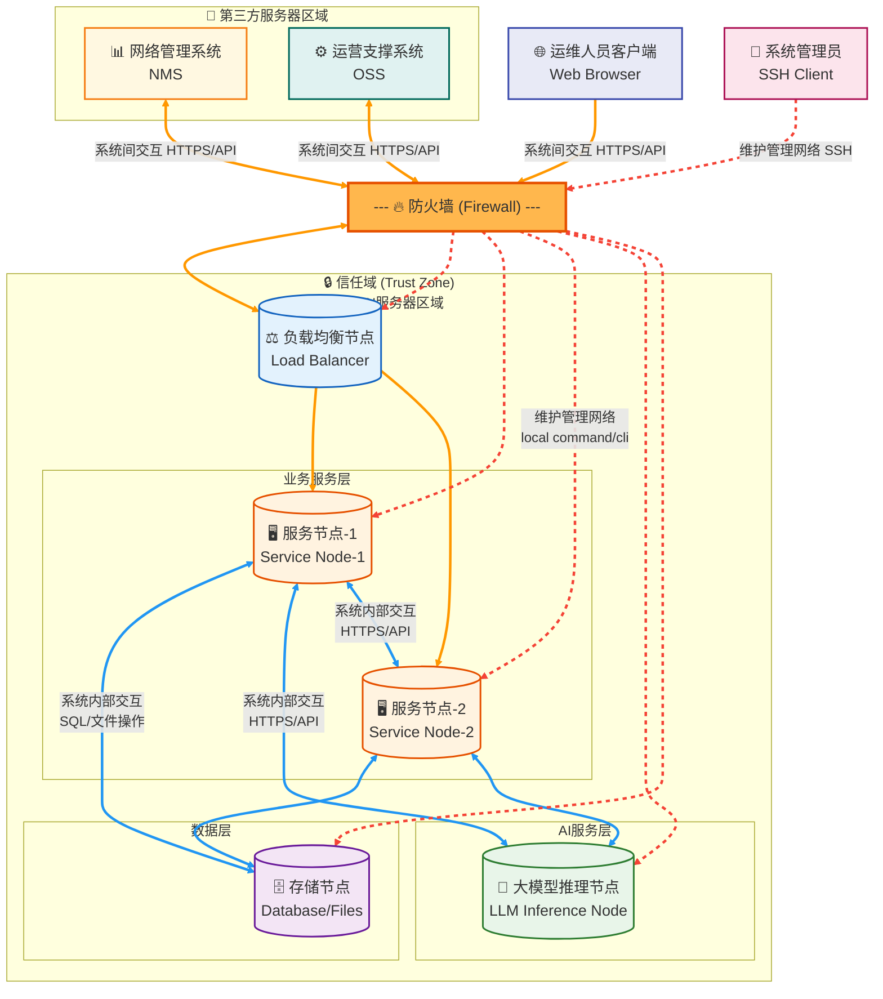

# OpenAN产品概述
## 产品介绍
TODO 

## 技术架构
TODO 

## 设计约束
- 仅支持Linux系统部署
- 仅支持IPV4
- 当前仅支持两种语言：中文、英文
- AgentCard中不可含有敏感/机密数据及个人信息

# 安全架构设计
## 整体安全架构
OpenAN产品作为完整的独立系统，其安全架构模型由3个层次，10个维度组成。 
三个层次分别为：
- 组网安全：包括安全域划分、防火墙隔离、入侵检测出等安全方案，通过安全组网技术对OpenAN网络提供防护
- 平台安全：包括系统加固、安全补丁、防病毒三类防护手段，通过提升操作系统的安全级别，为OpenAN业务应用提供安全可靠的平台
- 应用安全：包括传输安全、日志审计、认证鉴权等方案，这些安全策略应用与具体业务

## 组网安全
- 仅支持OP部署，不对公网开放
- 配置防火墙；
- 网络隔离：内部服务间交互与系统间交互使用不同端口；
如下是OpenAN组网建议示例，完整的安全组网由客户提供，以客户系统实际组网为准。

安全组网分为：
- OpenAN服务器区域：
此区域部署OpenAN关键业务服务器，需受到高级别的安全防护，任何来自非信任域或风险区域的接入访问应收到严格的控制，与其他网络区域之间也应提供完善的隔离防护策略。
- 第三方服务器区域：
此区域部署其他厂家的网络管理系统、运营支撑系统，或客户内部基于整个网络层面的基础设施系统（如3A服务器）。
- 运维人员客户端接入区域：
运维人员通过浏览器下发OpenAN操作
- 管理员接入区域：
后台维护

## 平台安全
TODO 

## 应用安全
部署运行：最小权限：非root用户运行、文件权限最小、无提权操作；流量控制 
网络传输：TLS通信加密、身份认证 
功能特性：agentcard完整性保护、高危agent审核、审计日志等 

### 功能特性
#### Agent注册中心
agent注册中心：安全通信、日志审计、agentcard完整性保护、高危agent审核等安全功能特性 
参见agent注册中心用户指南安全能力章节 

#### 调测工具
##### 自签名证书生成工具
